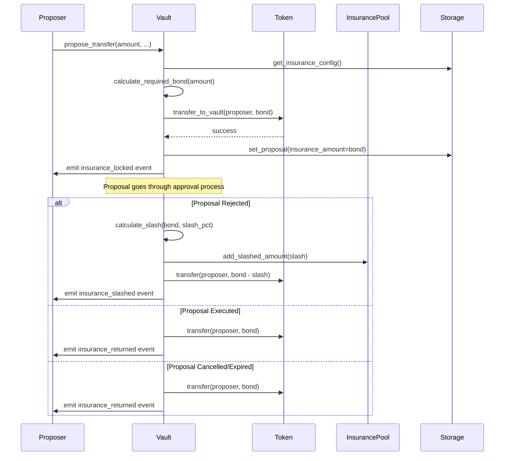

# Design Document: Proposal Insurance System

## Overview

The Proposal Insurance System adds a bond-based deterrent mechanism to the VaultDAO multisig treasury contract. Proposers must post refundable bonds when creating proposals above a configured threshold. Bonds are calculated as a percentage of the proposal amount and are held in escrow by the vault. When proposals are rejected, a configurable percentage of the bond is slashed and added to an insurance pool. When proposals are executed successfully, the full bond is refunded to the proposer. This creates economic incentives for good governance while protecting the vault from malicious or careless proposals.

The system integrates seamlessly with the existing proposal lifecycle, supporting cancellation, expiration, and all existing proposal features. It includes reputation-based discounts for trusted proposers and comprehensive event emission for transparency.

## Architecture

The insurance system is implemented as an extension to the existing VaultDAO contract with minimal changes to the core proposal flow. The architecture follows these principles:

1. **Non-invasive Integration**: Insurance logic is added to existing functions (propose_transfer, execute_proposal, reject_proposal) without breaking existing behavior
2. **Configurable**: All insurance parameters are stored in InsuranceConfig and can be enabled/disabled by admins
3. **Backward Compatible**: When insurance is disabled, the system behaves exactly as before
4. **Event-Driven**: All insurance operations emit events for off-chain tracking and UI updates

### Component Interaction Flow



## Components and Interfaces

### 1. InsuranceConfig Structure

Already defined in `types.rs`:

```rust
pub struct InsuranceConfig {
    pub enabled: bool,
    pub min_amount: i128,
    pub min_insurance_bps: u32,
    pub slash_percentage: u32,
}
```

**Fields:**
- `enabled`: Master switch for the insurance system
- `min_amount`: Minimum proposal amount that requires insurance (in stroops)
- `min_insurance_bps`: Minimum bond as basis points of proposal amount (e.g., 100 = 1%)
- `slash_percentage`: Percentage of bond to slash on rejection (0-100)

### 2. Bond Calculation Module

**Function**: `calculate_required_bond(amount: i128, config: &InsuranceConfig, reputation: &Reputation) -> i128`

**Logic:**
1. If `amount < config.min_amount`, return 0
2. Calculate base bond: `amount * config.min_insurance_bps / 10_000`
3. Apply reputation discount: if `reputation.score >= 750`, divide bond by 2
4. Return calculated bond

**Error Handling:**
- Check for overflow in multiplication before division
- Return error if arithmetic overflow occurs

### 3. Bond Posting Integration

**Location**: `propose_transfer()` function in `lib.rs`

**Integration Points:**
1. After spending limit checks, before creating proposal
2. Call `calculate_required_bond()` with proposal amount
3. If bond > 0, call `token::transfer_to_vault()` to lock bond
4. Store bond amount in `proposal.insurance_amount`
5. Emit `insurance_locked` event

**Error Handling:**
- If transfer fails, abort proposal creation
- If proposer has insufficient balance, return `InsuranceInsufficient` error

### 4. Slashing Logic

**Location**: `reject_proposal()` function in `lib.rs`

**Integration Points:**
1. After status update to Rejected
2. Check if `proposal.insurance_amount > 0`
3. Calculate slash: `slash_amount = insurance_amount * slash_percentage / 100`
4. Calculate refund: `refund = insurance_amount - slash_amount`
5. Add slash to insurance pool (stays in vault)
6. Transfer refund to proposer
7. Emit `insurance_slashed` event

**Error Handling:**
- Check for overflow in slash calculation
- If refund transfer fails, log but don't revert (slash already applied)

### 5. Bond Refund Logic

**Location**: `execute_proposal()` function in `lib.rs`

**Integration Points:**
1. After successful token transfer to recipient
2. Check if `proposal.insurance_amount > 0`
3. Transfer full bond back to proposer
4. Emit `insurance_returned` event

**Error Handling:**
- If refund transfer fails, revert entire execution (atomicity)

**Location**: `cancel_proposal()` function in `lib.rs`

**Integration Points:**
1. After status update to Cancelled
2. Check if `proposal.insurance_amount > 0`
3. Transfer full bond back to proposer
4. Emit `insurance_returned` event

**Error Handling:**
- If refund transfer fails, revert cancellation

### 6. Insurance Pool Management

**Storage**: Insurance pool is implicit - slashed bonds remain in the vault contract's token balance

**Tracking**: Add new storage function to track total slashed amount:

```rust
pub fn get_insurance_pool_balance(env: &Env, token: &Address) -> i128
pub fn add_to_insurance_pool(env: &Env, token: &Address, amount: i128)
```

**Admin Functions**: Add new admin function to withdraw from insurance pool:

```rust
pub fn withdraw_insurance_pool(
    env: Env,
    admin: Address,
    token: Address,
    recipient: Address,
    amount: i128,
) -> Result<(), VaultError>
```

**Access Control**: Only addresses with `Role::Admin` can withdraw from insurance pool

### 7. Configuration Management

**Admin Function**: Add function to update insurance configuration:

```rust
pub fn set_insurance_config(
    env: Env,
    admin: Address,
    config: InsuranceConfig,
) -> Result<(), VaultError>
```

**Validation:**
- Verify caller has `Role::Admin`
- Validate `slash_percentage` is between 0 and 100
- Validate `min_insurance_bps` is reasonable (e.g., <= 10000)
- Emit `insurance_config_updated` event

### 8. Event Emission

All insurance events are already defined in `events.rs`:
- `emit_insurance_locked`: When bond is posted
- `emit_insurance_slashed`: When bond is slashed on rejection
- `emit_insurance_returned`: When bond is refunded
- `emit_insurance_config_updated`: When config is updated by admin

## Data Models

### Proposal Structure (Existing)

The `Proposal` struct already includes the `insurance_amount` field:

```rust
pub struct Proposal {
    // ... existing fields ...
    pub insurance_amount: i128,  // Bond posted by proposer
    // ... existing fields ...
}
```

### InsuranceConfig (Existing)

Already defined in `types.rs` - no changes needed.

### Storage Keys (Existing)

The `DataKey` enum already includes:
- `InsuranceConfig`: Stores the insurance configuration
- Storage functions already exist in `storage.rs`

### New Storage Requirements

Add per-token insurance pool tracking:

```rust
pub enum DataKey {
    // ... existing keys ...
    InsurancePool(Address),  // Token address -> total slashed amount
}
```

## Correctness Properties

*A property is a characteristic or behavior that should hold true across all valid executions of a system—essentially, a formal statement about what the system should do. Properties serve as the bridge between human-readable specifications and machine-verifiable correctness guarantees.*

### Property 1: Bond Enforcement When Enabled

*For any* proposal with amount >= min_amount when insurance is enabled, the vault should require a bond >= (amount * min_insurance_bps / 10_000) before accepting the proposal.

**Validates: Requirements 1.2, 2.2, 2.3**

### Property 2: No Bond When Disabled or Below Threshold

*For any* proposal when insurance is disabled OR when amount < min_amount, the vault should accept the proposal without requiring any bond (insurance_amount = 0).

**Validates: Requirements 1.6, 2.1**

### Property 3: Bond Calculation Correctness

*For any* proposal amount and insurance configuration, the calculated bond should equal (amount * min_insurance_bps / 10_000) with reputation discount applied if score >= 750, and should never overflow.

**Validates: Requirements 2.2, 2.4**

### Property 4: Bond Transfer and Recording

*For any* proposal requiring a bond, after successful proposal creation, the proposer's token balance should decrease by the bond amount, the vault's balance should increase by the bond amount, and proposal.insurance_amount should equal the bond.

**Validates: Requirements 3.2, 3.3**

### Property 5: Insufficient Balance Rejection

*For any* proposal where the proposer's balance is less than the required bond, the vault should reject the proposal creation and return an error.

**Validates: Requirements 3.1, 3.4**

### Property 6: Slashing Calculation and Distribution

*For any* rejected proposal with a bond, the slash amount should equal (bond * slash_percentage / 100), the insurance pool balance should increase by the slash amount, and the proposer should receive (bond - slash amount) as refund.

**Validates: Requirements 4.1, 4.2, 4.3, 4.4**

### Property 7: Full Refund on Execution

*For any* successfully executed proposal with a bond, the proposer should receive the full bond amount back, and the proposal status should be Executed.

**Validates: Requirements 5.1, 5.2**

### Property 8: Execution Atomicity

*For any* proposal execution, if the bond refund transfer fails, the entire execution transaction (including the main transfer) should be reverted.

**Validates: Requirements 5.3, 7.5**

### Property 9: Full Refund on Cancellation or Expiration

*For any* cancelled or expired proposal with a bond, the proposer should receive the full bond amount back without any slashing.

**Validates: Requirements 8.2, 8.3**

### Property 10: Insurance Pool Accumulation

*For any* sequence of proposal rejections, the insurance pool balance for a token should equal the sum of all slashed amounts for that token.

**Validates: Requirements 6.1, 6.2**

### Property 11: Admin-Only Pool Withdrawal

*For any* withdrawal attempt from the insurance pool, the transaction should succeed only if the caller has Role::Admin, and should transfer the requested amount from the pool to the recipient.

**Validates: Requirements 6.4, 6.5**

### Property 12: Configuration Validation

*For any* insurance configuration update, the vault should accept it only if slash_percentage is between 0 and 100 (inclusive) and the caller has Role::Admin.

**Validates: Requirements 7.6**

### Property 13: Backward Compatibility

*For any* proposal when insurance is disabled, the proposal lifecycle (creation, approval, execution, rejection, cancellation) should behave identically to the pre-insurance system.

**Validates: Requirements 8.1, 8.5**

### Property 14: Non-Interference with Existing Mechanisms

*For any* proposal with a bond, the approval process, voting, quorum checks, timelock delays, and spending limits should function exactly as they do for proposals without bonds.

**Validates: Requirements 8.4**

### Property 15: Event Emission Completeness

*For any* insurance operation (bond posting, slashing, refund, config update, pool withdrawal), the vault should emit the corresponding event with correct parameters.

**Validates: Requirements 3.5, 4.5, 5.4, 6.6**

## Error Handling

### Error Types

The system uses existing `VaultError` enum with new variants:

```rust
pub enum VaultError {
    // ... existing errors ...
    InsuranceInsufficient,      // Proposer doesn't have enough for bond
    InsurancePoolInsufficient,  // Pool doesn't have enough for withdrawal
    InvalidSlashPercentage,     // Slash percentage not in 0-100 range
    ArithmeticOverflow,         // Overflow in bond/slash calculation
}
```

### Error Scenarios

1. **Bond Calculation Overflow**: Return `ArithmeticOverflow` if `amount * min_insurance_bps` overflows
2. **Insufficient Proposer Balance**: Return `InsuranceInsufficient` if proposer can't cover bond
3. **Bond Transfer Failure**: Abort proposal creation, return transfer error
4. **Slash Calculation Overflow**: Return `ArithmeticOverflow` if slash calculation overflows
5. **Refund Transfer Failure on Execution**: Revert entire transaction (atomicity)
6. **Refund Transfer Failure on Cancellation**: Revert cancellation
7. **Invalid Configuration**: Return `InvalidSlashPercentage` if slash_percentage > 100
8. **Unauthorized Pool Withdrawal**: Return `Unauthorized` if caller is not Admin
9. **Insufficient Pool Balance**: Return `InsurancePoolInsufficient` if withdrawal exceeds pool

### Recovery Mechanisms

- **Failed Bond Posting**: Proposal is not created, no state changes
- **Failed Execution Refund**: Entire execution reverts, proposal remains in Approved state
- **Failed Cancellation Refund**: Cancellation reverts, proposal remains in Pending state
- **Failed Slashing Refund**: Slash is applied, but if refund fails, log error and continue (proposer loses refund)

## Testing Strategy

### Dual Testing Approach

The insurance system requires both unit tests and property-based tests for comprehensive coverage:

**Unit Tests**: Focus on specific examples, edge cases, and integration points
- Specific bond calculations with known inputs/outputs
- Edge cases: zero amounts, maximum amounts, overflow scenarios
- Integration with existing proposal lifecycle
- Error conditions and recovery

**Property-Based Tests**: Verify universal properties across randomized inputs
- Bond calculation correctness for all amounts and configurations
- Slashing and refund arithmetic for all percentages
- State transitions for all proposal lifecycles
- Invariants like pool balance accumulation

### Property-Based Testing Configuration

**Library**: Use `proptest` crate for Rust property-based testing

**Test Configuration**:
- Minimum 100 iterations per property test
- Each test tagged with feature name and property number
- Tag format: `// Feature: proposal-insurance, Property N: <property text>`

**Example Property Test Structure**:

```rust
#[cfg(test)]
mod insurance_properties {
    use proptest::prelude::*;
    
    // Feature: proposal-insurance, Property 1: Bond Enforcement When Enabled
    proptest! {
        #[test]
        fn prop_bond_required_when_enabled(
            amount in 1000i128..1_000_000_000i128,
            min_amount in 100i128..10_000i128,
            min_insurance_bps in 1u32..1000u32,
        ) {
            // Test that bond is required when amount >= min_amount
        }
    }
}
```

### Unit Test Coverage

**Bond Calculation Tests**:
- Test with amount below threshold (expect 0 bond)
- Test with amount at threshold (expect calculated bond)
- Test with amount above threshold (expect calculated bond)
- Test with reputation discount (score >= 750)
- Test overflow scenarios

**Bond Posting Tests**:
- Test successful bond posting with sufficient balance
- Test rejection with insufficient balance
- Test bond recording in proposal structure
- Test event emission

**Slashing Tests**:
- Test slashing with various percentages (0%, 50%, 100%)
- Test refund calculation
- Test insurance pool accumulation
- Test event emission

**Refund Tests**:
- Test full refund on execution
- Test full refund on cancellation
- Test full refund on expiration
- Test atomicity on refund failure

**Integration Tests**:
- Test complete proposal lifecycle with bonds
- Test interaction with existing features (timelock, spending limits, etc.)
- Test backward compatibility with insurance disabled
- Test admin configuration updates

### Test Data Generators

**For Property Tests**:
- Generate random proposal amounts (1 to max i128)
- Generate random insurance configurations
- Generate random reputation scores
- Generate random slash percentages (0-100)
- Generate random token balances

**Edge Cases to Cover**:
- Zero amounts
- Maximum i128 amounts
- Amounts just below/at/above min_amount threshold
- Zero bond scenarios
- 0% and 100% slash percentages
- Reputation scores at boundary (749, 750, 751)

### Test Execution

**Unit Tests**: Run with `cargo test`
**Property Tests**: Run with `cargo test --features proptest` (minimum 100 iterations)
**Integration Tests**: Run with `cargo test --test integration`

### Success Criteria

- All unit tests pass
- All property tests pass with 100+ iterations
- Code coverage >= 90% for insurance-related code
- No panics or overflows in property tests
- All error paths tested and verified
