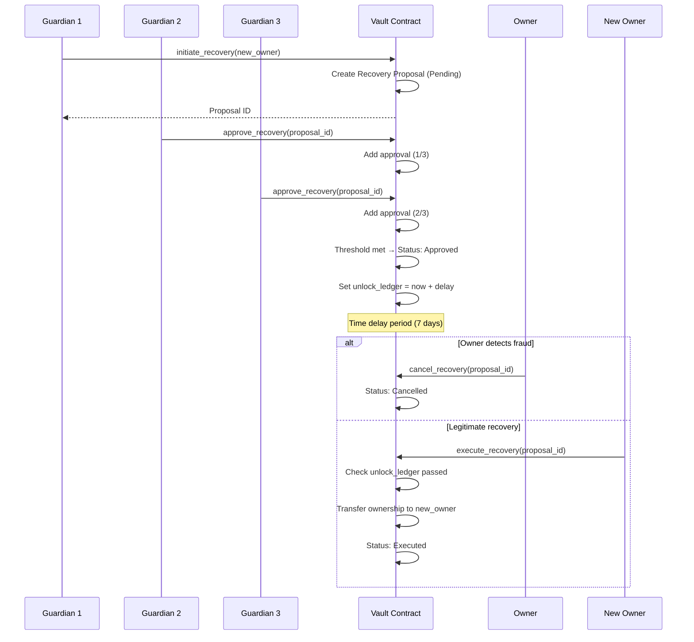
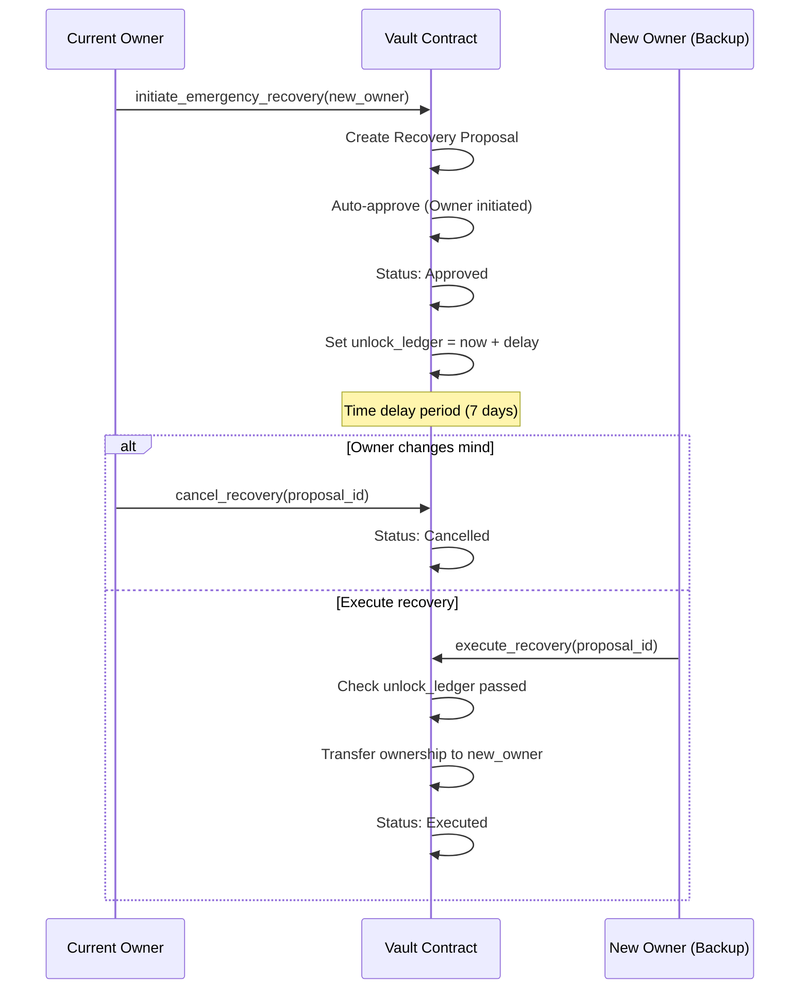

# Design Document: Wallet Recovery Mechanism

## Overview

The wallet recovery mechanism provides a secure way to recover access to a VaultDAO multisig treasury when the owner loses their private keys. The system implements two complementary recovery strategies:

1. **Social Recovery**: Trusted guardians collectively approve ownership transfer through a threshold-based voting system
2. **Emergency Recovery**: The current owner can initiate a time-delayed ownership transfer to a backup address

Both strategies enforce mandatory time delays to provide a security window for detecting and canceling fraudulent recovery attempts. The recovery system is designed to prevent permanent fund loss while maintaining strong security guarantees against unauthorized access.

### Key Design Principles

- **Defense in Depth**: Multiple guardians required, time delays enforced, owner can cancel
- **Fail-Safe**: Recovery possible even if owner loses all keys (via guardians)
- **Transparency**: All recovery actions emit events for monitoring
- **Simplicity**: Clear state machine with well-defined transitions
- **Gas Efficiency**: Minimal storage overhead, efficient guardian management

## Architecture

### Component Overview

```
┌─────────────────────────────────────────────────────────────┐
│                      VaultDAO Contract                       │
├─────────────────────────────────────────────────────────────┤
│                                                               │
│  ┌──────────────────────────────────────────────────────┐  │
│  │           Guardian Management Module                  │  │
│  │  - Add/Remove Guardians                              │  │
│  │  - Configure Threshold                                │  │
│  │  - Query Guardian Status                              │  │
│  └──────────────────────────────────────────────────────┘  │
│                          │                                   │
│                          ▼                                   │
│  ┌──────────────────────────────────────────────────────┐  │
│  │         Recovery Proposal Management                  │  │
│  │  - Initiate Recovery (Guardian or Owner)             │  │
│  │  - Approve Recovery (Guardians)                       │  │
│  │  - Execute Recovery (Anyone after delay)             │  │
│  │  - Cancel Recovery (Owner)                            │  │
│  └──────────────────────────────────────────────────────┘  │
│                          │                                   │
│                          ▼                                   │
│  ┌──────────────────────────────────────────────────────┐  │
│  │              State Machine Validator                  │  │
│  │  - Validate State Transitions                         │  │
│  │  - Enforce Time Delays                                │  │
│  │  - Check Expiration                                   │  │
│  └──────────────────────────────────────────────────────┘  │
│                          │                                   │
│                          ▼                                   │
│  ┌──────────────────────────────────────────────────────┐  │
│  │                Storage Layer                          │  │
│  │  - Guardian List & Status                             │  │
│  │  - Recovery Proposals                                 │  │
│  │  - Configuration (Threshold, Delays)                  │  │
│  └──────────────────────────────────────────────────────┘  │
│                                                               │
└─────────────────────────────────────────────────────────────┘
```

### Recovery Flow Diagrams

#### Social Recovery Flow



#### Emergency Recovery Flow



## Components and Interfaces

### Guardian Management

#### Data Structures

```rust
/// Guardian information stored per address
#[contracttype]
#[derive(Clone, Debug)]
pub struct Guardian {
    /// Guardian address
    pub address: Address,
    /// Whether guardian is currently active
    pub is_active: bool,
    /// Ledger when guardian was added
    pub added_at: u64,
    /// Ledger when guardian was removed (0 if active)
    pub removed_at: u64,
}

/// Guardian configuration stored in vault config
#[contracttype]
#[derive(Clone, Debug)]
pub struct GuardianConfig {
    /// List of all guardians (active and inactive)
    pub guardians: Vec<Guardian>,
    /// Number of guardian approvals required for recovery
    pub threshold: u32,
    /// Time delay in ledgers before recovery can execute
    pub recovery_delay: u64,
    /// Time in ledgers before recovery proposal expires
    pub recovery_expiry: u64,
}
```

#### Functions

```rust
/// Add a new guardian (Owner only)
pub fn add_guardian(
    env: Env,
    owner: Address,
    guardian: Address,
) -> Result<(), VaultError>

/// Remove a guardian (Owner only)
pub fn remove_guardian(
    env: Env,
    owner: Address,
    guardian: Address,
) -> Result<(), VaultError>

/// Set the guardian approval threshold (Owner only)
pub fn set_guardian_threshold(
    env: Env,
    owner: Address,
    threshold: u32,
) -> Result<(), VaultError>

/// Get all active guardians
pub fn get_guardians(env: Env) -> Vec<Address>

/// Check if an address is an active guardian
pub fn is_guardian(env: Env, address: Address) -> bool

/// Get the current guardian threshold
pub fn get_guardian_threshold(env: Env) -> u32
```

### Recovery Proposal Management

#### Data Structures

```rust
/// Recovery proposal status
#[contracttype]
#[derive(Clone, Debug, PartialEq, Eq)]
#[repr(u32)]
pub enum RecoveryStatus {
    /// Awaiting guardian approvals
    Pending = 0,
    /// Threshold met, waiting for time delay
    Approved = 1,
    /// Ownership transferred successfully
    Executed = 2,
    /// Cancelled by owner
    Cancelled = 3,
    /// Expired without execution
    Expired = 4,
}

/// Recovery proposal
#[contracttype]
#[derive(Clone, Debug)]
pub struct RecoveryProposal {
    /// Unique proposal ID
    pub id: u64,
    /// Address that initiated the recovery
    pub initiator: Address,
    /// New owner address to transfer control to
    pub new_owner: Address,
    /// Guardian addresses that have approved
    pub approvals: Vec<Address>,
    /// Current proposal status
    pub status: RecoveryStatus,
    /// Ledger when proposal was created
    pub created_at: u64,
    /// Earliest ledger when execution is allowed
    pub unlock_ledger: u64,
    /// Ledger when proposal expires
    pub expires_at: u64,
    /// Whether this was owner-initiated (emergency recovery)
    pub is_owner_initiated: bool,
}
```

#### Functions

```rust
/// Initiate recovery as a guardian (Social Recovery)
pub fn initiate_recovery(
    env: Env,
    guardian: Address,
    new_owner: Address,
) -> Result<u64, VaultError>

/// Initiate emergency recovery as owner
pub fn initiate_emergency_recovery(
    env: Env,
    owner: Address,
    new_owner: Address,
) -> Result<u64, VaultError>

/// Approve a recovery proposal (Guardian only)
pub fn approve_recovery(
    env: Env,
    guardian: Address,
    proposal_id: u64,
) -> Result<(), VaultError>

/// Execute an approved recovery proposal (Anyone can call after delay)
pub fn execute_recovery(
    env: Env,
    executor: Address,
    proposal_id: u64,
) -> Result<(), VaultError>

/// Cancel a recovery proposal (Owner only)
pub fn cancel_recovery(
    env: Env,
    owner: Address,
    proposal_id: u64,
) -> Result<(), VaultError>

/// Get recovery proposal by ID
pub fn get_recovery_proposal(
    env: Env,
    proposal_id: u64,
) -> Result<RecoveryProposal, VaultError>

/// Check if an active recovery proposal exists
pub fn has_active_recovery(env: Env) -> bool
```

### State Machine Validator

The recovery proposal follows a strict state machine:

```
                    ┌─────────┐
                    │ Pending │
                    └────┬────┘
                         │
              ┌──────────┼──────────┐
              │          │          │
         (threshold  (cancelled) (expired)
           met)         │          │
              │          │          │
              ▼          ▼          ▼
         ┌─────────┐ ┌──────────┐ ┌─────────┐
         │Approved │ │Cancelled │ │ Expired │
         └────┬────┘ └──────────┘ └─────────┘
              │           (terminal states)
    ┌─────────┼─────────┐
    │         │         │
(executed) (cancelled) (expired)
    │         │         │
    ▼         ▼         ▼
┌─────────┐ ┌──────────┐ ┌─────────┐
│Executed │ │Cancelled │ │ Expired │
└─────────┘ └──────────┘ └─────────┘
 (terminal)   (terminal)   (terminal)
```

#### Valid State Transitions

- `Pending → Approved`: When guardian approval threshold is met
- `Pending → Cancelled`: When owner cancels
- `Pending → Expired`: When expiration time is reached
- `Approved → Executed`: When time delay passes and execution succeeds
- `Approved → Cancelled`: When owner cancels
- `Approved → Expired`: When expiration time is reached
- No transitions from `Executed`, `Cancelled`, or `Expired` (terminal states)

## Data Models

### Storage Keys

```rust
#[contracttype]
#[derive(Clone)]
pub enum DataKey {
    // ... existing keys ...
    
    /// Guardian configuration -> GuardianConfig
    GuardianConfig,
    
    /// Guardian info by address -> Guardian
    Guardian(Address),
    
    /// Recovery proposal by ID -> RecoveryProposal
    RecoveryProposal(u64),
    
    /// Next recovery proposal ID counter -> u64
    NextRecoveryProposalId,
    
    /// Active recovery proposal ID (only one allowed) -> Option<u64>
    ActiveRecoveryProposal,
}
```

### Storage Layout

- **GuardianConfig**: Instance storage (persistent, long TTL)
- **Guardian(Address)**: Persistent storage per guardian
- **RecoveryProposal(u64)**: Persistent storage per proposal
- **NextRecoveryProposalId**: Instance storage (counter)
- **ActiveRecoveryProposal**: Instance storage (tracks current active proposal)

### Integration with Existing Config

The guardian configuration will be added to the existing `Config` struct:

```rust
pub struct Config {
    // ... existing fields ...
    
    /// Guardian recovery configuration (optional)
    pub guardian_config: Option<GuardianConfig>,
}
```

## Correctness Properties

*A property is a characteristic or behavior that should hold true across all valid executions of a system—essentially, a formal statement about what the system should do. Properties serve as the bridge between human-readable specifications and machine-verifiable correctness guarantees.*

### Property 1: Guardian Addition Preserves Active Status

*For any* valid guardian address, when added to the guardian list, the guardian should be stored with active status set to true and should appear in the active guardians list.

**Validates: Requirements 1.1, 1.3**

### Property 2: Guardian Removal Marks Inactive

*For any* active guardian, when removed from the guardian list, the guardian should be marked as inactive and should not appear in the active guardians list or be able to participate in recovery operations.

**Validates: Requirements 1.2, 1.4**

### Property 3: Guardian Threshold Validation

*For any* threshold value, setting the guardian threshold should succeed if and only if the threshold is at least 1 and does not exceed the number of active guardians.

**Validates: Requirements 1.8, 9.2, 9.3**

### Property 4: Recovery Initiation Creates Pending Proposal

*For any* active guardian and valid new owner address, when initiating recovery, a Recovery_Proposal should be created with status Pending, containing the new owner address, initiating guardian, and creation timestamp.

**Validates: Requirements 2.1, 2.2**

### Property 5: Single Active Recovery Proposal

*For any* vault state, when an active Recovery_Proposal exists (status Pending or Approved), attempting to create a new Recovery_Proposal should fail.

**Validates: Requirements 2.3**

### Property 6: Unlock Ledger Calculation

*For any* Recovery_Proposal, the unlock_ledger should equal the created_at ledger plus the configured recovery_delay.

**Validates: Requirements 2.4**

### Property 7: Guardian Authorization for Recovery

*For any* address, initiating recovery should succeed if and only if the address is an active guardian.

**Validates: Requirements 2.5**

### Property 8: Guardian Approval Recording

*For any* active guardian and pending Recovery_Proposal, when the guardian approves, the guardian address should be added to the approvals list and should not be able to approve the same proposal again.

**Validates: Requirements 3.1, 3.2**

### Property 9: Threshold-Based Status Transition

*For any* Recovery_Proposal in Pending status, when the number of approvals reaches the configured threshold, the status should transition to Approved.

**Validates: Requirements 3.3, 3.4**

### Property 10: Time Delay Enforcement

*For any* approved Recovery_Proposal, execution should fail if the current ledger is less than the unlock_ledger, and should succeed if the current ledger is greater than or equal to the unlock_ledger (and all other conditions are met).

**Validates: Requirements 4.1, 4.3**

### Property 11: Ownership Transfer on Execution

*For any* executed Recovery_Proposal, the vault owner should be the new_owner address specified in the proposal, and the proposal status should be Executed.

**Validates: Requirements 4.5, 4.6**

### Property 12: Owner Cancellation Authority

*For any* Recovery_Proposal in Pending or Approved status, the current owner should be able to cancel it, changing the status to Cancelled and preventing further approvals or execution.

**Validates: Requirements 5.1, 5.2, 5.3**

### Property 13: Executed Proposals Are Immutable

*For any* Recovery_Proposal with status Executed, attempting to cancel it should fail.

**Validates: Requirements 5.5**

### Property 14: Automatic Expiration

*For any* Recovery_Proposal, when the current ledger exceeds the expires_at ledger, the status should be Expired and execution should fail.

**Validates: Requirements 6.2, 6.3**

### Property 15: New Proposal After Expiration

*For any* vault with an expired Recovery_Proposal, creating a new Recovery_Proposal should succeed.

**Validates: Requirements 6.4**

### Property 16: Owner Emergency Recovery Auto-Approval

*For any* owner-initiated Recovery_Proposal, the status should be immediately set to Approved (skipping the Pending phase), but the time delay should still be enforced.

**Validates: Requirements 7.3, 7.4**

### Property 17: Valid State Transitions Only

*For any* Recovery_Proposal, state transitions should only occur according to the defined state machine: Pending can transition to Approved/Cancelled/Expired, Approved can transition to Executed/Cancelled/Expired, and terminal states (Executed/Cancelled/Expired) cannot transition to any other state.

**Validates: Requirements 8.1, 8.3, 8.5**

## Error Handling

### New Error Types

```rust
#[contracterror]
#[derive(Copy, Clone, Debug, Eq, PartialEq)]
#[repr(u32)]
pub enum VaultError {
    // ... existing errors ...
    
    // Recovery errors (15xx)
    /// Guardian already exists
    GuardianAlreadyExists = 1500,
    /// Guardian not found
    GuardianNotFound = 1501,
    /// Not enough guardians (minimum 2 required)
    InsufficientGuardians = 1502,
    /// Too many guardians (maximum 10)
    TooManyGuardians = 1503,
    /// Guardian threshold invalid
    InvalidGuardianThreshold = 1504,
    /// Not an active guardian
    NotAGuardian = 1505,
    /// Recovery proposal not found
    RecoveryProposalNotFound = 1506,
    /// Active recovery proposal already exists
    ActiveRecoveryExists = 1507,
    /// Recovery proposal not in pending status
    RecoveryNotPending = 1508,
    /// Recovery proposal not approved
    RecoveryNotApproved = 1509,
    /// Recovery time delay not expired
    RecoveryTimelockActive = 1510,
    /// Recovery proposal has expired
    RecoveryExpired = 1511,
    /// Guardian already approved this recovery
    GuardianAlreadyApproved = 1512,
    /// Cannot modify executed recovery
    RecoveryAlreadyExecuted = 1513,
    /// Cannot modify cancelled recovery
    RecoveryAlreadyCancelled = 1514,
    /// Invalid recovery state transition
    InvalidRecoveryTransition = 1515,
}
```

### Error Handling Strategy

1. **Input Validation**: All functions validate inputs before state changes
2. **Authorization Checks**: Verify caller has required role (Owner/Guardian)
3. **State Validation**: Ensure proposal is in correct state for operation
4. **Time Checks**: Validate time delays and expiration
5. **Atomic Operations**: All state changes are atomic (succeed or fail completely)
6. **Descriptive Errors**: Each error code clearly indicates the failure reason

## Testing Strategy

### Unit Tests

Unit tests will cover specific examples and edge cases:

1. **Guardian Management**
   - Add first guardian (should fail - minimum 2 required)
   - Add 2 guardians (should succeed)
   - Add 11th guardian (should fail - maximum 10)
   - Remove guardian when at minimum (should fail if would go below 2)
   - Set threshold to 0 (should fail)
   - Set threshold above guardian count (should fail)

2. **Recovery Initiation**
   - Non-guardian initiates recovery (should fail)
   - Guardian initiates with active proposal existing (should fail)
   - Owner initiates emergency recovery (should auto-approve)

3. **Recovery Approval**
   - Guardian approves twice (should fail second time)
   - Non-guardian approves (should fail)
   - Approval on cancelled proposal (should fail)

4. **Recovery Execution**
   - Execute before time delay (should fail)
   - Execute after time delay (should succeed)
   - Execute expired proposal (should fail)
   - Execute cancelled proposal (should fail)

5. **Recovery Cancellation**
   - Owner cancels pending proposal (should succeed)
   - Owner cancels approved proposal (should succeed)
   - Owner cancels executed proposal (should fail)
   - Non-owner cancels (should fail)

### Property-Based Tests

Property-based tests will verify universal properties across randomized inputs. Each test will run a minimum of 100 iterations with randomly generated data.

**Test Configuration**: Using `soroban-sdk` test framework with custom generators for addresses, ledger numbers, and proposal states.

1. **Property Test 1: Guardian Addition Preserves Active Status**
   - Generate random guardian addresses
   - Add guardians and verify active status
   - **Tag**: Feature: wallet-recovery, Property 1: Guardian Addition Preserves Active Status

2. **Property Test 2: Guardian Removal Marks Inactive**
   - Generate random guardians, add them, then remove
   - Verify inactive status and inability to participate
   - **Tag**: Feature: wallet-recovery, Property 2: Guardian Removal Marks Inactive

3. **Property Test 3: Guardian Threshold Validation**
   - Generate random threshold values (valid and invalid)
   - Verify only valid thresholds are accepted
   - **Tag**: Feature: wallet-recovery, Property 3: Guardian Threshold Validation

4. **Property Test 4: Recovery Initiation Creates Pending Proposal**
   - Generate random guardians and new owner addresses
   - Initiate recovery and verify proposal structure
   - **Tag**: Feature: wallet-recovery, Property 4: Recovery Initiation Creates Pending Proposal

5. **Property Test 5: Single Active Recovery Proposal**
   - Create proposal, attempt to create another
   - Verify second attempt fails
   - **Tag**: Feature: wallet-recovery, Property 5: Single Active Recovery Proposal

6. **Property Test 6: Unlock Ledger Calculation**
   - Generate random creation ledgers and delays
   - Verify unlock_ledger = created_at + delay
   - **Tag**: Feature: wallet-recovery, Property 6: Unlock Ledger Calculation

7. **Property Test 7: Guardian Authorization for Recovery**
   - Generate random addresses (guardians and non-guardians)
   - Verify only guardians can initiate
   - **Tag**: Feature: wallet-recovery, Property 7: Guardian Authorization for Recovery

8. **Property Test 8: Guardian Approval Recording**
   - Generate random guardians and proposals
   - Approve and verify no duplicate approvals
   - **Tag**: Feature: wallet-recovery, Property 8: Guardian Approval Recording

9. **Property Test 9: Threshold-Based Status Transition**
   - Generate random thresholds and approval counts
   - Verify status changes when threshold met
   - **Tag**: Feature: wallet-recovery, Property 9: Threshold-Based Status Transition

10. **Property Test 10: Time Delay Enforcement**
    - Generate random ledger times before and after unlock
    - Verify execution fails before, succeeds after
    - **Tag**: Feature: wallet-recovery, Property 10: Time Delay Enforcement

11. **Property Test 11: Ownership Transfer on Execution**
    - Generate random recovery proposals and execute
    - Verify ownership changes to new_owner
    - **Tag**: Feature: wallet-recovery, Property 11: Ownership Transfer on Execution

12. **Property Test 12: Owner Cancellation Authority**
    - Generate proposals in various states
    - Verify owner can cancel Pending/Approved only
    - **Tag**: Feature: wallet-recovery, Property 12: Owner Cancellation Authority

13. **Property Test 13: Executed Proposals Are Immutable**
    - Execute proposals, attempt cancellation
    - Verify cancellation fails
    - **Tag**: Feature: wallet-recovery, Property 13: Executed Proposals Are Immutable

14. **Property Test 14: Automatic Expiration**
    - Generate proposals with various expiration times
    - Advance ledger past expiration, verify status
    - **Tag**: Feature: wallet-recovery, Property 14: Automatic Expiration

15. **Property Test 15: New Proposal After Expiration**
    - Expire proposals, create new ones
    - Verify new proposals succeed
    - **Tag**: Feature: wallet-recovery, Property 15: New Proposal After Expiration

16. **Property Test 16: Owner Emergency Recovery Auto-Approval**
    - Generate owner-initiated proposals
    - Verify immediate Approved status with time delay
    - **Tag**: Feature: wallet-recovery, Property 16: Owner Emergency Recovery Auto-Approval

17. **Property Test 17: Valid State Transitions Only**
    - Generate proposals in all states
    - Attempt all possible transitions
    - Verify only valid transitions succeed
    - **Tag**: Feature: wallet-recovery, Property 17: Valid State Transitions Only

### Integration Tests

Integration tests will verify the recovery mechanism works correctly with the existing VaultDAO functionality:

1. Recovery doesn't interfere with normal proposal operations
2. Recovered owner can perform all owner functions
3. Guardian management integrates with existing role system
4. Events are emitted correctly for monitoring
5. Storage TTL is managed correctly for recovery data

### Test Coverage Goals

- **Line Coverage**: >95% for recovery module
- **Branch Coverage**: 100% for state machine transitions
- **Property Coverage**: All 17 correctness properties tested
- **Edge Case Coverage**: All boundary conditions tested (min/max guardians, threshold limits, time boundaries)
