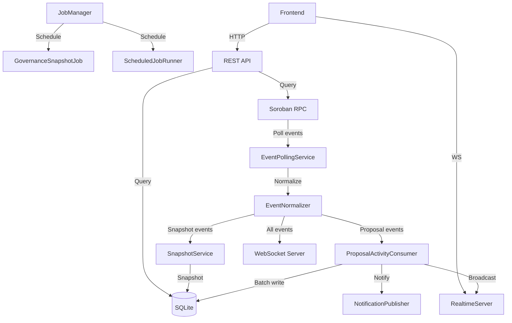
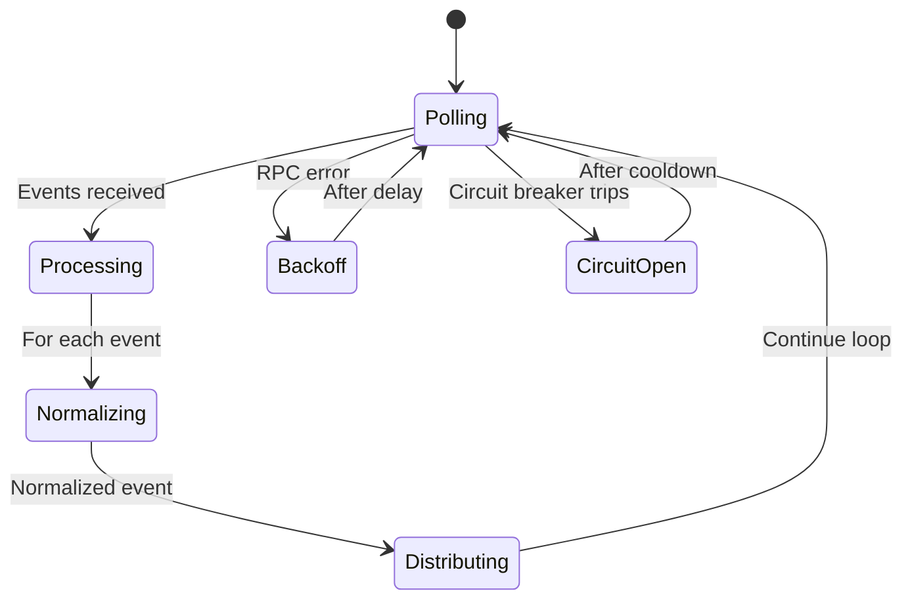

# Backend Modules Guide

This guide explains the VaultDAO backend module system: how modules are structured, how the event pipeline works, how the cursor and job systems operate, and how to add a new module.

---

## Table of Contents

1. [Module Architecture Overview](#module-architecture-overview)
2. [Module-by-Module Reference](#module-by-module-reference)
3. [Event Pipeline Walkthrough](#event-pipeline-walkthrough)
4. [Cursor System](#cursor-system)
5. [Job Manager](#job-manager)
6. [Proposal Consumer Deep-Dive](#proposal-consumer-deep-dive)
7. [Adding a New Module](#adding-a-new-module)

---

## Module Architecture Overview

All backend modules live under `backend/src/modules/`. Each module is a self-contained unit with its own routes, controllers, services, types, and tests.

```
backend/src/modules/
├── audit/          # Audit trail queries
├── contracts/      # Contract interaction helpers
├── events/         # Soroban event polling + cursor + normalizers
├── health/         # Health checks + Prometheus metrics
├── jobs/           # Background job scheduling
├── notifications/  # Outbound notification publishing
├── proposals/      # Proposal indexing + activity consumer
├── realtime/       # WebSocket server + topic subscriptions
├── recurring/      # Recurring payment management
├── snapshots/      # Governance state snapshots
├── transactions/   # Transaction history
├── vault/          # Vault configuration queries
└── websocket/      # Low-level WebSocket server
```

### Data Flow Diagram



---

## Module-by-Module Reference

### `events/` — Event Polling Service

**Purpose**: Polls the Soroban RPC for contract events, normalizes them, and distributes to downstream consumers.

**Key files**:
- `events.service.ts` — `EventPollingService` class. Runs a polling loop with exponential backoff and circuit breaker protection.
- `events.types.ts` — Type definitions for raw contract events and polling state.
- `normalizers/` — Transform raw Soroban events into typed `NormalizedEvent` objects. One normalizer per domain (proposals, recurring, escrow, etc.).
- `cursor/` — Persists the last processed ledger so the service can resume after restarts.

### `proposals/` — Proposal Indexing

**Purpose**: Consumes normalized proposal events and produces `ProposalActivityRecord` entries for the activity feed and API.

**Key files**:
- `consumer.ts` — `ProposalActivityConsumer`. Buffers events, flushes in batches, supports retry.
- `aggregator.ts` — Aggregates proposal data from multiple events into a coherent view.
- `transforms.ts` — Maps raw event data to activity record fields.
- `proposals.controller.ts` — REST API endpoints for proposal queries.
- `proposals.routes.ts` — Route definitions.

### `audit/` — Audit Trail

**Purpose**: Provides queryable audit logs for all vault operations.

**Key files**:
- `audit.service.ts` — Query logic for audit entries stored in SQLite.
- `audit.controller.ts` — REST endpoints for audit log queries.
- `audit.types.ts` — Audit entry type definitions.

### `health/` — Health Checks & Metrics

**Purpose**: Exposes health check and Prometheus metrics endpoints for monitoring.

**Key files**:
- `health.service.ts` — Dependency readiness checks (RPC connectivity, database, etc.).
- `health.controller.ts` — `/health/ready` and `/health/live` endpoints.
- `metrics.registry.ts` — `MetricsRegistry` class for tracking counters, histograms, gauges.
- `metrics.controller.ts` — `/metrics` endpoint in Prometheus exposition format.
- `metrics.formatter.ts` — Formats metric values for Prometheus scraping.

### `jobs/` — Background Job Manager

**Purpose**: Centralized lifecycle management for background jobs.

**Key files**:
- `job.manager.ts` — `JobManager` class. Registers, starts, stops, and observes jobs with dependency ordering.
- `scheduled-job-runner.ts` — Cron-like runner for periodic jobs.
- `governance-snapshot.job.ts` — Periodic governance state snapshot job.
- `jobs.routes.ts` — REST endpoints for job status inspection.

### `realtime/` — Real-time Server

**Purpose**: Manages WebSocket connections with topic-based subscriptions for live updates.

**Key files**:
- `realtime-server.ts` — `RealtimeServer` class. Handles connections, heartbeats, topic subscriptions, and message broadcasting.
- `types.ts` — Connection and envelope type definitions.

### `websocket/` — WebSocket Event Server

**Purpose**: Lower-level WebSocket server that broadcasts raw contract events to connected clients.

**Key files**:
- `websocket.server.ts` — `EventWebSocketServer` class. Receives events from the polling service and broadcasts to all connected clients.

### `recurring/` — Recurring Payments

**Purpose**: Manages recurring payment schedules, conflict detection, and execution tracking.

**Key files**:
- `recurring.service.ts` — CRUD operations for recurring payment configurations.
- `recurring.controller.ts` — REST API endpoints.
- `types.ts` — Payment schedule and conflict types.

### `transactions/` — Transaction History

**Purpose**: Indexes and queries vault transaction history.

**Key files**:
- `transactions.service.ts` — Query logic for transaction records.
- `transactions.controller.ts` — REST endpoints.
- `transactions.types.ts` — Transaction record types.

### `snapshots/` — Governance Snapshots

**Purpose**: Periodic snapshots of governance state for historical analysis.

**Key files**:
- `snapshot.service.ts` — Snapshot creation and query logic.
- `normalizer.ts` — `SnapshotNormalizer` for snapshot-related events.

### `notifications/` — Notification Publishing

**Purpose**: Outbound notification delivery for vault events (webhook, email, etc.).

**Key files**:
- `notification.types.ts` — Publisher interface and notification payload types.

---

## Event Pipeline Walkthrough

The event pipeline is the backbone of the backend. It transforms raw Stellar contract events into queryable data and real-time updates.

### Step 1: Polling (EventPollingService)

The `EventPollingService` in `events/events.service.ts` runs a continuous polling loop:

1. Reads the last processed cursor position (ledger number)
2. Calls the Soroban RPC `getEvents` with the cursor as `startLedger`
3. Processes up to `EVENTS_PAGE_LIMIT` (200) events per poll
4. Uses exponential backoff on errors (up to `MAX_BACKOFF_MS` = 5 minutes)
5. The `CircuitBreaker` trips after repeated RPC failures, preventing cascading errors



### Step 2: Normalization (EventNormalizer)

Raw Soroban events contain ScVal-encoded data. The `EventNormalizer` in `events/normalizers/` transforms them into typed `NormalizedEvent` objects.

Each normalizer handles a specific domain:
- `proposal.normalizer.ts` — Proposal lifecycle events (created, approved, executed, etc.)
- `recurring.normalizer.ts` — Recurring payment events
- `escrow.normalizer.ts` — Escrow milestone and release events
- `subscription.normalizer.ts` — Subscription events
- `recovery.normalizer.ts` — Recovery and emergency events
- `role.normalizer.ts` — Role assignment events
- `generic.normalizer.ts` — Catch-all for unrecognized topics
- `unknown.normalizer.ts` — Fallback for completely unknown events

The normalizer is selected based on the event topic. The `PROPOSAL_TOPICS` set in `events.service.ts` routes proposal-related events to the `ProposalActivityConsumer`.

### Step 3: Distribution

After normalization, events are distributed to three downstream systems:

1. **ProposalActivityConsumer** — Receives events matching `PROPOSAL_TOPICS`. Produces activity records, triggers notifications, and broadcasts to realtime rooms.
2. **SnapshotService** — Receives snapshot-related events for governance state tracking.
3. **EventWebSocketServer** — Receives all events for raw broadcast to connected clients.

### Step 4: Persistence

The `ProposalActivityConsumer` buffers events and flushes them in batches (default: 100 events or every 5 seconds) to SQLite for durable storage.

---

## Cursor System

The cursor tracks the last successfully processed ledger, allowing the event service to resume after restarts without missing or re-processing events.

### Why Two Cursor Types Exist

VaultDAO supports two cursor storage backends:

| Type | Implementation | Use Case |
|---|---|---|
| **File cursor** | `file-cursor.adapter.ts` | Simple deployments, single-process, easy to inspect/reset |
| **Database cursor** | `database-cursor.adapter.ts` | Multi-process deployments, transactional consistency with event data |

Both implement the `CursorStorage` interface defined in `cursor/index.ts`.

### File Cursor

Stores the cursor as a JSON file (e.g., `/app/data/cursor.json`):

```json
{
  "lastLedger": 12345678,
  "lastEventId": "0053882506637312-0000000001"
}
```

**Pros**: Easy to inspect, back up, and manually reset.  
**Cons**: Not atomic with event processing — a crash between processing and writing could cause a small window of missed events (mitigated by event deduplication).

### Database Cursor

Stores the cursor in a SQLite `cursors` table, updated transactionally alongside event data.

**Pros**: Atomic updates with event persistence — no gap between processing and cursor advancement.  
**Cons**: Requires SQLite access, harder to manually inspect.

### Migration Path

To migrate from file cursor to database cursor:

1. Read the current file cursor values
2. Insert them into the `cursors` table
3. Update the backend configuration to use the database adapter
4. Remove or archive the cursor file

### Cursor Lag Measurement

Cursor lag = (current chain tip ledger) - (cursor's `lastLedger`). This metric (`vaultdao_cursor_lag_ledgers`) is exposed via the metrics endpoint and should be monitored. Lag above ~100 ledgers indicates the polling service is falling behind.

---

## Job Manager

The `JobManager` in `jobs/job.manager.ts` provides centralized lifecycle management for background jobs.

### How Jobs Are Registered

Jobs implement the `Job` interface:

```typescript
interface Job {
  readonly name: string;
  start(): Promise<void> | void;
  stop(): Promise<void> | void;
  isRunning(): boolean;
}
```

Registration is done at application startup:

```typescript
const jobManager = new JobManager(metricsRegistry);

jobManager.registerJob(governanceSnapshotJob);
jobManager.registerJob(scheduledJobRunner, {
  dependencies: ['governance-snapshot'],
});
```

### Dependency Ordering

Jobs can declare dependencies. The `JobManager` performs a topological sort to ensure dependencies start first. It detects cycles and throws `JobDependencyCycle` if the dependency graph is invalid.

### How Jobs Are Scheduled

The `ScheduledJobRunner` wraps the cron-like scheduling logic. It reads job schedules from configuration and triggers registered jobs at the appropriate intervals.

The `GovernanceSnapshotJob` is an example of a scheduled job that periodically captures governance state and stores it for historical analysis.

### Observation

The `JobManager` integrates with `MetricsRegistry` to expose job status metrics:
- Whether each job is running
- Failure counts
- Execution duration

These metrics are available at `/metrics` and can be scraped by Prometheus.

---

## Proposal Consumer Deep-Dive

The `ProposalActivityConsumer` in `proposals/consumer.ts` is the most complex consumer in the pipeline.

### Idempotency

The consumer is designed to be idempotent — processing the same event twice produces the same result. This is critical because:

- Event cursor resets may cause re-processing
- The `EventPollingService` has overlapping poll windows
- Network retries may deliver duplicate events

Idempotency is achieved through:
1. **Event ID deduplication** — The `processedEventIds` set (with a cap of 1000 entries) in the polling service filters duplicates before they reach the consumer.
2. **Unique activity record IDs** — Each `ProposalActivityRecord` gets a UUID generated from the event data, preventing duplicate database inserts.
3. **Upsert semantics** — The persistence layer uses INSERT OR IGNORE for activity records.

### Batch Processing

Events are buffered and flushed in batches for efficiency:

- **Buffer size**: 100 events (configurable via `DEFAULT_BATCH_SIZE`)
- **Flush interval**: 5 seconds (configurable via `DEFAULT_FLUSH_INTERVAL_MS`)
- Whichever threshold is hit first triggers a flush
- A `pendingFlush` flag prevents concurrent flushes

### Adapter Pattern

The consumer uses an adapter pattern for downstream integration:

- `ProposalEventConsumer` — Interface for individual event handlers
- `ProposalBatchConsumer` — Interface for batch event handlers
- `ProposalActivityPersistence` — Interface for storage backends

This allows swapping storage backends (SQLite, PostgreSQL, etc.) without modifying the consumer logic.

### Retry and Error Handling

Failed persistence operations are tracked in a `retryBuffer`. The consumer:
1. Attempts to write the batch
2. On failure, moves records to the retry buffer
3. Increments `failureCount`
4. Retries on the next flush cycle
5. Logs persistent failures for alerting

### Notification Integration

After producing an activity record, the consumer optionally:
1. Publishes to the `NotificationPublisher` queue for outbound notifications
2. Calls the `onActivity` hook to broadcast to realtime WebSocket rooms

---

## Adding a New Module

This section walks through adding a hypothetical `treasury-reports` module that generates periodic treasury balance reports.

### Step 1: Create the Module Directory

```
backend/src/modules/treasury-reports/
├── index.ts
├── types.ts
├── treasury-reports.service.ts
├── treasury-reports.controller.ts
├── treasury-reports.routes.ts
└── treasury-reports.service.test.ts
```

### Step 2: Define Types

```typescript
// types.ts
export interface TreasuryReport {
  id: string;
  vaultId: string;
  generatedAt: string;
  balances: TokenBalance[];
  totalValueXlm: bigint;
}

export interface TokenBalance {
  token: string;
  symbol: string;
  balance: bigint;
}
```

### Step 3: Implement the Service

```typescript
// treasury-reports.service.ts
import { createLogger } from "../../shared/logging/logger.js";
import type { TreasuryReport } from "./types.js";

export class TreasuryReportService {
  private readonly logger = createLogger("treasury-reports");

  async generateReport(vaultId: string): Promise<TreasuryReport> {
    this.logger.info(`generating treasury report for vault ${vaultId}`);
    // Query balances from Soroban RPC
    // Aggregate and return
  }

  async getReport(reportId: string): Promise<TreasuryReport | null> {
    // Query from SQLite
  }

  async listReports(vaultId: string): Promise<TreasuryReport[]> {
    // Query from SQLite
  }
}
```

### Step 4: Create the Controller

```typescript
// treasury-reports.controller.ts
import type { Request, Response } from "express";
import type { TreasuryReportService } from "./treasury-reports.service.js";

export class TreasuryReportController {
  constructor(private readonly service: TreasuryReportService) {}

  async generate(req: Request, res: Response) {
    const { vaultId } = req.params;
    const report = await this.service.generateReport(vaultId);
    res.json(report);
  }

  async get(req: Request, res: Response) {
    const report = await this.service.getReport(req.params.id);
    if (!report) return res.status(404).json({ error: "not found" });
    res.json(report);
  }
}
```

### Step 5: Define Routes

```typescript
// treasury-reports.routes.ts
import { Router } from "express";
import type { TreasuryReportController } from "./treasury-reports.controller.js";

export function createTreasuryReportRoutes(
  controller: TreasuryReportController
): Router {
  const router = Router();
  router.post("/vaults/:vaultId/reports", (req, res) => controller.generate(req, res));
  router.get("/reports/:id", (req, res) => controller.get(req, res));
  return router;
}
```

### Step 6: Register as a Job (Optional)

If the report should be generated periodically:

```typescript
// treasury-reports.job.ts
import type { Job } from "../jobs/job.manager.js";
import type { TreasuryReportService } from "./treasury-reports.service.js";

export class TreasuryReportJob implements Job {
  readonly name = "treasury-report";

  constructor(
    private readonly service: TreasuryReportService,
    private readonly vaultId: string,
  ) {}

  async start() {
    await this.service.generateReport(this.vaultId);
  }

  async stop() {}

  isRunning() {
    return false;
  }
}
```

Register it with the JobManager:

```typescript
jobManager.registerJob(new TreasuryReportJob(reportService, vaultId), {
  dependencies: [],
});
```

### Step 7: Wire into the Application

In `backend/src/app.ts`, import and register the routes:

```typescript
import { createTreasuryReportRoutes } from "./modules/treasury-reports/treasury-reports.routes.js";

// ... in app setup
const reportService = new TreasuryReportService();
const reportController = new TreasuryReportController(reportService);
app.use("/api", createTreasuryReportRoutes(reportController));
```

### Step 8: Add an Event Normalizer (Optional)

If the module needs to react to contract events, create a normalizer:

```typescript
// In events/normalizers/treasury.normalizer.ts
import type { NormalizedEvent } from "../types.js";

export function normalizeTreasuryEvent(raw: any): NormalizedEvent {
  return {
    type: "treasury_balance_changed",
    // ... map fields
  };
}
```

Register it in `events/normalizers/index.ts` and add the relevant topics to the event distribution logic in `events.service.ts`.

### Step 9: Write Tests

Follow the existing test patterns — co-locate test files with implementation:

```typescript
// treasury-reports.service.test.ts
import { describe, it, expect } from "vitest";
import { TreasuryReportService } from "./treasury-reports.service.js";

describe("TreasuryReportService", () => {
  it("generates a report with token balances", async () => {
    const service = new TreasuryReportService();
    const report = await service.generateReport("CVAULT...");
    expect(report.balances).toBeDefined();
    expect(report.totalValueXlm).toBeGreaterThanOrEqual(0n);
  });
});
```
