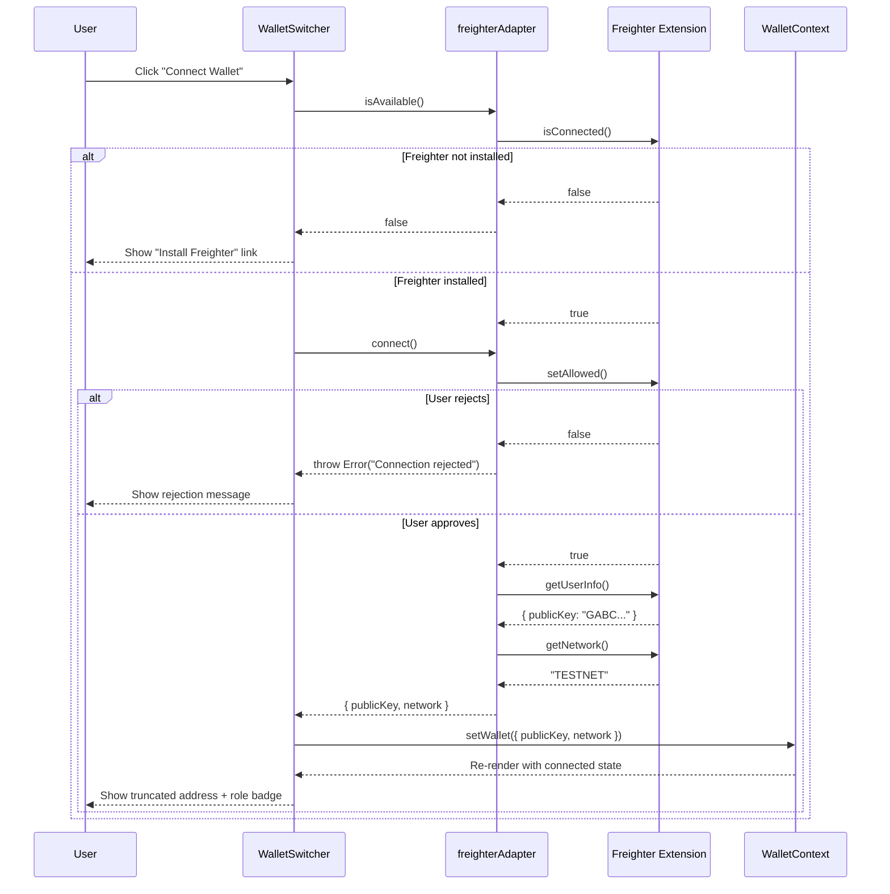
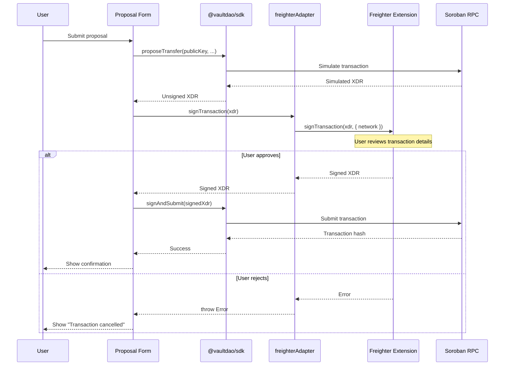

# Wallet Integration Guide

This guide explains how VaultDAO integrates with Stellar wallets via the Freighter browser extension, how to handle wallet-related edge cases, and how to test wallet interactions.

---

## Table of Contents

1. [Freighter API Overview](#freighter-api-overview)
2. [Connection Flow](#connection-flow)
3. [Error Handling Guide](#error-handling-guide)
4. [Testing Wallet Interactions](#testing-wallet-interactions)
5. [Multi-Wallet Support](#multi-wallet-support)
6. [Security Considerations](#security-considerations)

---

## Freighter API Overview

VaultDAO uses `@stellar/freighter-api` through a wallet adapter pattern defined in `frontend/src/adapters/freighterAdapter.ts`. The adapter wraps the following Freighter functions:

### `isConnected()`

Checks whether the Freighter browser extension is installed and active. Returns `true`/`false`. Called during adapter initialization to determine wallet availability.

```typescript
const available = await freighterAdapter.isAvailable();
// Internally calls: isConnected() from @stellar/freighter-api
```

### `setAllowed()` / `isAllowed()`

`setAllowed()` requests the user's permission for VaultDAO to access their Freighter wallet. This triggers a Freighter popup asking the user to approve the connection. `isAllowed()` checks if permission was previously granted without prompting.

```typescript
// In freighterAdapter.connect():
const allowed = await setAllowed();
if (!allowed) throw new Error('Connection rejected');
```

### `getUserInfo()`

Returns the user's public key and other wallet metadata after permission is granted. This is how VaultDAO gets the connected address.

```typescript
const userInfo = await getUserInfo();
// userInfo.publicKey → "GABC..."
```

### `getNetwork()`

Returns the currently selected network in Freighter (e.g., `"TESTNET"`, `"PUBLIC"`). VaultDAO checks this to ensure the user is on the correct network before submitting transactions.

```typescript
const network = await getNetwork();
// "TESTNET" | "PUBLIC" | "FUTURENET"
```

### `signTransaction(xdr, options)`

Presents a transaction to the user in Freighter for review and signing. The user sees the full transaction details before approving. Returns the signed XDR.

```typescript
const signedXdr = await freighterSignTransaction(xdr, {
  network: 'TESTNET',
});
```

---

## Connection Flow

The following diagram shows the complete wallet connection flow from button click to connected state:



### Transaction Signing Flow



---

## Error Handling Guide

### Freighter Not Installed

**When it happens**: User visits VaultDAO without the Freighter extension installed.

**How VaultDAO handles it**: The `freighterAdapter.isAvailable()` method calls `isConnected()` which returns `false`. The WalletSwitcher displays a link to install Freighter at `https://www.freighter.app/`.

**Expected UX**: A non-intrusive prompt with the install link. All read-only features (viewing proposals, vault info) remain accessible.

```typescript
// In WalletSwitcher — check availability before showing connect option
if (!await adapter.isAvailable()) {
  // Show install prompt with link to adapter.url
}
```

### User Rejection (Connection)

**When it happens**: User clicks "Connect" but declines the Freighter permission popup.

**How VaultDAO handles it**: `setAllowed()` returns `false`, and the adapter throws `Error('Connection rejected')`. The WalletContext catches this and keeps the disconnected state.

**Expected UX**: Brief toast notification — "Wallet connection was declined. You can connect anytime using the wallet button."

### User Rejection (Transaction Signing)

**When it happens**: User initiates a proposal or approval but cancels in the Freighter signing popup.

**How VaultDAO handles it**: `signTransaction()` throws an error. The UI catches it and does not submit anything to the network.

**Expected UX**: The form remains filled so the user can retry. Show message — "Transaction was not signed. No changes were made."

### Wrong Network

**When it happens**: User's Freighter is set to Testnet but VaultDAO is configured for Mainnet (or vice versa).

**How VaultDAO handles it**: After connection, the adapter calls `getNetwork()` and the WalletContext compares it against the expected network. If they don't match, the user is prompted to switch networks.

**Expected UX**: Warning banner — "Your wallet is connected to Testnet, but this VaultDAO instance uses Mainnet. Please switch networks in Freighter."

```typescript
const { network } = await adapter.connect();
if (network !== expectedNetwork) {
  // Show network mismatch warning
  // Disable transaction-related actions
}
```

### Locked Wallet

**When it happens**: Freighter is installed but locked (user hasn't entered their password).

**How VaultDAO handles it**: `isConnected()` may return `true` but `getUserInfo()` returns no public key. The adapter throws `Error('No public key')`.

**Expected UX**: Message — "Your wallet appears to be locked. Please unlock Freighter and try again."

### Session Timeout

**When it happens**: User was previously connected but Freighter session expired or the page was refreshed.

**How VaultDAO handles it**: On mount, the WalletContext attempts to restore the session by checking `isAllowed()` and then calling `getUserInfo()`. If the session is no longer valid, the user is prompted to reconnect.

---

## Testing Wallet Interactions

### Mocking `@stellar/freighter-api` in Vitest

Create a mock that replaces Freighter API calls for testing. VaultDAO uses the adapter pattern, so you can mock at the adapter level:

```typescript
// test/mocks/wallet.ts
import type { WalletAdapter } from '../../src/adapters/types';

export function createMockWalletAdapter(
  overrides: Partial<WalletAdapter> = {}
): WalletAdapter {
  return {
    id: 'mock',
    name: 'Mock Wallet',
    url: 'https://example.com',
    isAvailable: async () => true,
    connect: async () => ({
      publicKey: 'GAAAAAAAAAAAAAAAAAAAAAAAAAAAAAAAAAAAAAAAAAAAAAAAAAAAAWHF',
      network: 'TESTNET',
    }),
    disconnect: async () => {},
    getPublicKey: async () =>
      'GAAAAAAAAAAAAAAAAAAAAAAAAAAAAAAAAAAAAAAAAAAAAAAAAAAAAWHF',
    getNetwork: async () => 'TESTNET',
    signTransaction: async (xdr: string) => xdr,
    ...overrides,
  };
}
```

### Testing Connection Flow

```typescript
import { render, screen, fireEvent, waitFor } from '@testing-library/react';
import { WalletSwitcher } from '../components/WalletSwitcher';
import { createMockWalletAdapter } from './mocks/wallet';

describe('WalletSwitcher', () => {
  it('shows connected address after successful connection', async () => {
    const mockAdapter = createMockWalletAdapter();
    const onSelect = vi.fn();

    render(
      <WalletSwitcher
        availableWallets={[mockAdapter]}
        selectedWalletId={null}
        onSelect={onSelect}
      />
    );

    fireEvent.click(screen.getByRole('button'));
    await waitFor(() => {
      expect(onSelect).toHaveBeenCalledWith(mockAdapter);
    });
  });

  it('handles connection rejection gracefully', async () => {
    const mockAdapter = createMockWalletAdapter({
      connect: async () => {
        throw new Error('Connection rejected');
      },
    });

    render(
      <WalletSwitcher
        availableWallets={[mockAdapter]}
        selectedWalletId={null}
        onSelect={vi.fn()}
      />
    );

    // Adapter throws but UI should not crash
    expect(screen.getByRole('button')).toBeInTheDocument();
  });
});
```

### Testing Transaction Signing

```typescript
describe('Transaction signing', () => {
  it('handles user rejection of signing', async () => {
    const mockAdapter = createMockWalletAdapter({
      signTransaction: async () => {
        throw new Error('User declined signing');
      },
    });

    // Use the adapter in your component test
    // Verify the error is caught and the UI shows an appropriate message
  });

  it('handles wrong network during signing', async () => {
    const mockAdapter = createMockWalletAdapter({
      getNetwork: async () => 'PUBLIC', // Mainnet when expecting testnet
    });

    // Verify network mismatch is detected
  });
});
```

### Mocking at the Freighter API Level

If you need to test the adapter itself rather than components that consume it:

```typescript
// Mock @stellar/freighter-api directly
vi.mock('@stellar/freighter-api', () => ({
  isConnected: vi.fn().mockResolvedValue(true),
  isAllowed: vi.fn().mockResolvedValue(true),
  setAllowed: vi.fn().mockResolvedValue(true),
  getUserInfo: vi.fn().mockResolvedValue({
    publicKey: 'GAAAAAAAAAAAAAAAAAAAAAAAAAAAAAAAAAAAAAAAAAAAAAAAAAAAAWHF',
  }),
  getNetwork: vi.fn().mockResolvedValue('TESTNET'),
  signTransaction: vi.fn().mockResolvedValue('signed-xdr-string'),
}));
```

---

## Multi-Wallet Support

### How WalletSwitcher Handles Session Management

The `WalletSwitcher` component (in `frontend/src/components/WalletSwitcher.tsx`) supports multiple wallet types (Freighter, Albedo, Rabet) through the adapter pattern defined in `frontend/src/adapters/`.

Each wallet type implements the `WalletAdapter` interface:

```typescript
interface WalletAdapter {
  id: string;           // 'freighter' | 'albedo' | 'rabet'
  name: string;         // Display name
  url: string;          // Install URL
  isAvailable(): Promise<boolean>;
  connect(): Promise<{ publicKey: string; network?: string }>;
  disconnect(): Promise<void>;
  getPublicKey(): Promise<string | null>;
  getNetwork(): Promise<string | null>;
  signTransaction(xdr: string, options?: { network?: string }): Promise<string>;
}
```

### Why Wallet State Is Not in Redux

Wallet state is managed via React Context (`WalletContext`) rather than Redux for several reasons:

1. **Session ephemeral nature**: Wallet connections are browser-session-scoped and tied to extension state. They can't be reliably serialized/deserialized like Redux state.
2. **Extension as source of truth**: The wallet extension itself is the source of truth for connection status, network, and available accounts. Redux would be a stale copy.
3. **Security**: Keeping wallet state in a context reduces the surface area for state inspection via Redux DevTools in production.
4. **Scope**: Only a few components need wallet state (WalletSwitcher, proposal forms, signing dialogs). Context provides sufficient scope without global state overhead.

### Account Switching

The WalletSwitcher supports switching between multiple accounts within a connected wallet. When a user switches accounts:

1. The `onSwitchAccount` callback is called with the new address
2. WalletContext updates the active address
3. Role badges are refreshed by querying the contract for the new address's role
4. Active subscriptions (WebSocket rooms) are re-joined with the new address

---

## Security Considerations

### Transaction Review Before Signing

VaultDAO always shows the full transaction details to the user before requesting a signature. This is enforced at two levels:

1. **SDK level**: The `proposeTransfer()`, `approveProposal()`, and other mutation functions return an unsigned XDR string. The signing step is always separate.
2. **Freighter level**: Freighter displays the transaction details (recipient, amount, contract call) in its signing popup. Users see exactly what they're approving.

### Never Auto-Signing

VaultDAO never stores private keys or signing credentials. Every transaction requires explicit user approval through the Freighter popup. There is no "remember my approval" or auto-sign feature because:

- Multisig vaults manage shared funds — every signature must be a conscious decision
- Auto-signing would undermine the security model that protects against compromised frontends
- The timelock system assumes human review of each transaction

### XDR Transparency

The raw XDR is available for inspection before signing. Advanced users can decode it independently:

```bash
# Decode and inspect a transaction XDR
stellar xdr dec --type TransactionEnvelope --xdr "AAAA..."
```

### Network Validation

Before every transaction, VaultDAO verifies that the wallet's active network matches the expected network. This prevents:

- Testnet transactions being signed with Mainnet credentials
- Funds being sent to the wrong network's contract instance
- Cross-network confusion in multi-environment setups

### Content Security Policy

The frontend's CSP restricts `connect-src` to the VaultDAO backend and known Stellar RPC endpoints, preventing malicious scripts from exfiltrating signed transactions to unauthorized endpoints.
