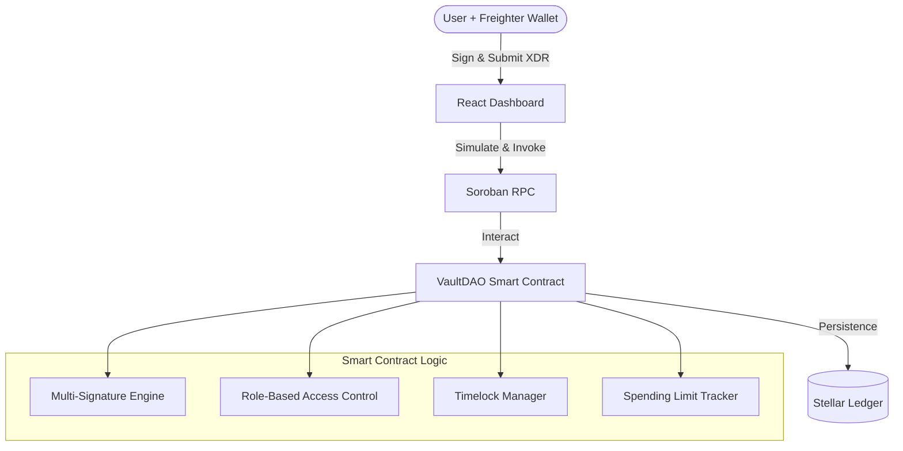

# VaultDAO Architecture

VaultDAO is a decentralized treasury management platform built on the Stellar network using Soroban smart contracts. This document outlines the technical architecture, component interactions, and security model.

## System Overview

The system consists of three main layers:

1.  **Soroban Smart Contracts**: Core logic for multi-sig, RBAC, and treasury management.
2.  **Frontend (React/TypeScript)**: User interface for managing vault operations.
3.  **Stellar Network (Testnet/Mainnet)**: The underlying infrastructure for transaction finality and data storage.

## Smart Contract Architecture (Rust)

The smart contract is written in Rust using the `soroban-sdk`. It is organized into several modules:

- **`lib.rs`**: Main entry point containing public contract functions.
- **`types.rs`**: Definitions for data structures like `Proposal`, `Role`, and `Config`.
- **`storage.rs`**: Helpers for managing Instance, Persistent, and Temporary storage.
- **`errors.rs`**: Custom error codes for the vault logic.
- **`events.rs`**: Standardized events emitted during contract execution.
- **`test.rs`**: Comprehensive unit and integration test suite.

### Storage Strategy

VaultDAO optimizes for ledger rent by using a hybrid storage model:

| Storage Type   | Usage                            | Rationale                                                        |
| :------------- | :------------------------------- | :--------------------------------------------------------------- |
| **Instance**   | `Config`, `Roles`                | Data that is consistently needed by every invocation.            |
| **Persistent** | `Proposals`, `RecurringPayments` | High-value data that must persist indefinitely.                  |
| **Temporary**  | `Daily/Weekly Limits`            | Ephemeral data that can be evicted after the time period passes. |

## Frontend Architecture (React)

The frontend is a modern SPA built with Vite, React, and Tailwind CSS.

- **Hooks**: Custom hooks (e.g., `useVaultContract`) encapsulate interaction with the Soroban RPC.
- **Context**: Manages wallet connection state (Freighter) and global configuration.
- **Components**: Modular UI components for proposal creation, list views, and status tracking.
- **Styling**: Responsive design using Tailwind CSS with glassmorphism aesthetics.

## Feature Stability Classification

### Definitions

| Tier | Meaning |
|------|---------|
| 🟢 **STABLE** | Production-ready. Public API is frozen; breaking changes require a major version bump. Safe to integrate and depend on. |
| 🟡 **EXPERIMENTAL** | Maturing. Core behaviour is stable but the API (function signatures, error codes, storage layout) may change in minor versions. Use with awareness of potential migration work. |
| 🔴 **UNSTABLE** | Development only. May be removed, redesigned, or renamed without notice. Do not use in production. |

---

### 🟢 STABLE — Production-Ready

| Feature | Functions | Notes |
|---------|-----------|-------|
| Core Multisig | `initialize`, `proposeTransfer`, `approveProposal`, `abstainProposal`, `executeProposal`, `cancelProposal` | M-of-N approval with full lifecycle |
| RBAC | `setRole`, `getRole`, `getRoleAssignments` | Admin / Treasurer / Member roles |
| Spending Limits | `updateLimits`, `updateThreshold`, `updateQuorum` | Per-proposal, daily, weekly caps |
| Timelocks | Automatic in `executeProposal` | Configurable delay on large transfers |
| Velocity Checks | Automatic in `proposeTransfer` | Sliding-window proposal rate limiting |
| Recipient Lists | `setListMode`, `addToWhitelist`, `removeFromWhitelist`, `addToBlacklist`, `removeFromBlacklist` | Whitelist / blacklist enforcement |
| Core Reads | `getProposal`, `listProposalIds`, `listProposals`, `getConfig`, `getSigners`, `isSigner`, `getTodaySpent` | Read-only, no auth required |
| Audit Trail | `getAuditEntry`, `getAuditEntryCount`, `verifyAuditTrail` | Tamper-evident hash chain |
| Attachments & Metadata | `addAttachment`, `removeAttachment`, `setProposalMetadata`, `addTag`, `removeTag` | IPFS CID attachments and key-value metadata |

---

### 🟡 EXPERIMENTAL — Maturing

| Feature | Functions | Notes |
|---------|-----------|-------|
| Batch Proposals | `batchProposeTransfers`, `batchExecuteProposals` | Multi-token batch; gas-optimized |
| Recurring Payments | `schedulePayment`, `executeRecurringPayment`, `getRecurringPayment`, `listRecurringPaymentIds`, `listRecurringPayments` | Keeper-bot compatible; min interval 720 ledgers |
| Hooks | `registerPreHook`, `registerPostHook`, `removePreHook`, `removePostHook`, `getPreHooks`, `getPostHooks` | Pre/post-execution callbacks |
| Veto | `vetoProposal` | Configured veto addresses only |
| Amendments | `amendProposal`, `getProposalAmendments` | Resets approvals; full audit trail |
| Cancellation History | `getCancellationRecord`, `getCancellationHistory` | Audit of cancelled proposals |
| Voting Strategy | `updateVotingStrategy`, `getVotingStrategy` | Simple / Weighted / Quadratic / Conviction |
| Quorum | `getQuorumStatus` | Minimum participation enforcement |
| Priority Queue | `changePriority`, `getProposalsByPriority` | Low / Normal / High / Critical |
| Reputation | `getReputation` (read-only); automatic scoring | Score affects spending limits and insurance |
| Insurance & Staking | `withdrawInsurancePool`, `withdrawStakePool`, `updateStakingConfig`, `getInsurancePool` | Proposer-staked collateral |
| Streaming Payments | `createStream` | Linear token streaming; early-stage |
| Escrow | `createEscrow`, `completeMilestone`, `releaseEscrowFunds`, `disputeEscrow`, `resolveEscrowDispute`, `getEscrowInfo` | Milestone-based fund release |
| DEX / AMM | `setDexConfig`, `proposeSwap` | Token swaps via whitelisted DEXes |
| Funding Rounds | `createFundingRound`, `approveFundingRound`, `submitMilestone`, `verifyMilestone`, `releaseRoundFunds`, `cancelFundingRound`, `getFundingRound` | Milestone-gated grant disbursement |
| Scheduled Proposals | `proposeScheduledTransfer`, `executeScheduledProposal`, `cancelScheduledProposal`, `getScheduledProposals` | Time-locked future execution |
| Dependency Proposals | `proposeTransferWithDeps` | DAG-based execution ordering |
| Gas Config | `setGasConfig`, `getGasConfig`, `estimateExecutionFee` | Per-proposal gas budgeting |
| Metrics | `getMetrics` | Vault-wide performance counters |
| Oracle | `updateOracleConfig`, `getAssetPrice` | Price-condition evaluation |
| Delegation | `delegateVotingPower`, `revokeDelegation` | Temporary vote delegation |
| Advanced Permissions | `grantPermission`, `revokePermission`, `delegatePermission`, `hasPermission` | Fine-grained capability grants |
| Time-Weighted Voting | `lockTokens`, `extendLock`, `unlockTokens`, `unlockEarly` | Lock tokens for voting multiplier |
| Dynamic Fees | Internal fee collection on execution | Volume-tier + reputation discounts |
| Notifications | `setNotificationPreferences` | Per-user event preferences |
| Comments | `addComment`, `editComment`, `getProposalComments` | On-chain proposal discussion |
| Templates | `createTemplate`, `getTemplate` | Reusable proposal configurations |

---

### 🔴 UNSTABLE — Development Only

> ⚠️ Do not use these features in production. They may be removed, renamed, or fundamentally redesigned.

| Feature | Functions | Reason for Instability |
|---------|-----------|------------------------|
| Bridge Module | `#[cfg(feature = "bridge")]` — not compiled by default | Cross-chain design not finalized; types incomplete |
| Wallet Recovery | `initiateRecovery`, `approveRecovery`, `executeRecovery`, `cancelRecovery` | Guardian set not audited; recovery delay semantics may change |
| Retry Logic | `getRetryState` | Exponential backoff strategy subject to redesign |
| Batch Transactions | `createBatch`, `executeBatch`, `getBatch`, `getBatchResult` | Rollback semantics not finalized; distinct from `batchExecuteProposals` |

## Security Model

Security is central to VaultDAO's design:

1.  **M-of-N Multisig**: Proposals require a threshold of approvals from authorized signers before they can be executed.
2.  **Role-Based Access Control (RBAC)**:
    - `Admin`: Can manage roles and update configuration.
    - `Treasurer`: Can propose and approve transfers.
    - `Member`: View-only access (planned).
3.  **Timelocks**: Transfers exceeding the `timelock_threshold` are locked for a delay (e.g., 24 hours/2000 ledgers). This provides a window for legitimate signers to cancel malicious or accidental proposals.
4.  **Enforced Limits**: Spending limits for daily and weekly windows ensure that even if a key is compromised, the maximum drain is capped.

## Data Flow: Proposal Lifecycle

1.  **Propose**: A `Treasurer` creates a proposal via the frontend.
2.  **Approve**: Other `Treasurers` review and approve the proposal until the `threshold` is reached.
3.  **Timelock (Optional)**: If the amount is large, the proposal enters a `Timelock` state.
4.  **Execute**: After approvals are met and timelock expires, any authorized user can execute the transfer.
5.  **Finalize**: The contract transfers the assets to the recipient and marks the proposal as `Executed`.
