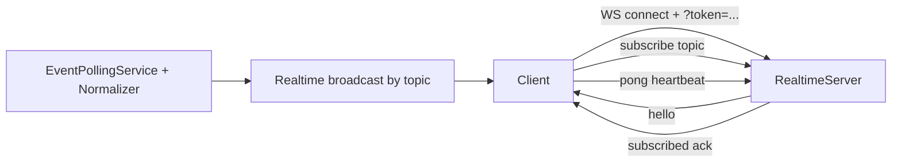

# VaultDAO Event System Reference (Topics, Payload Schemas, and Subscriptions)

> Status: reference documentation generated from `contracts/vault/src/events.rs`, backend normalizers, and realtime subscription code.

VaultDAO exposes on-chain **contract events** (emitted by the Soroban contract) and an off-chain **event system** that turns those raw events into **normalized payloads** suitable for:

- backend indexing & downstream consumers (notifications, proposal consumer, snapshots)
- **WebSocket** realtime streaming
- **SSE** streaming (see the SSE section; Issue #102)

This document is designed for external developers building integrations.

## Terminology

- **Contract event**: a Soroban event emitted by the VaultDAO smart contract. In this repo, the contract emits events via helper functions in `contracts/vault/src/events.rs`.
- **Contract topic**: the first topic symbol string included in `env.events().publish(...)` (e.g. `"proposal_created"`).
- **Normalized event**: the backend representation produced by event normalizers (see `backend/src/modules/events/normalizers/*`). Normalized events expose:
  - `type`: the backend `EventType`
  - `data`: event-specific payload (the part you typically care about)
  - `metadata`: shared envelope fields (ledger, id, contractId)
- **Realtime topic**: the topic string used for WebSocket subscriptions in this repo, formatted as `<namespace>.<key>`.

## Normalized event envelope

Most realtime and indexer flows use the same shape:

```ts
export interface EventMetadata {
  readonly id: string;
  readonly contractId: string;
  readonly ledger: number;
  readonly ledgerClosedAt: string;
}

export interface NormalizedEvent<T = any> {
  readonly type: EventType;
  readonly data: T;
  readonly metadata: EventMetadata;
}
```

### Field guarantees

From the backend types in `backend/src/modules/events/types.ts`:

- `metadata.id` is always present (string).
- `metadata.contractId` is always present (string).
- `metadata.ledger` is always present (number).
- `metadata.ledgerClosedAt` is always present (ISO string).
- `type` is always present.
- `data` is always present and matches one of the `*Data` interfaces documented below.

Normalization also performs implicit **type conversions**:

- Soroban addresses become strings.
- `i128` amounts become decimal strings.
- Ledgers/times remain numbers or ISO strings depending on the interface.

## Event lifecycle (Mermaid)

```mermaid
flowchart TD
  A[Contract emit<br/>`contracts/vault/src/events.rs`\n`env.events().publish(topic, data)`] --> B[Event polling service<br/>`EventPollingService`]
  B --> C[Event normalization<br/>`EventNormalizer` + per-topic normalizers]
  C --> D[Normalized event produced<br/>`NormalizedEvent<T>`]
  D --> E1[WebSocket broadcast<br/>`RealtimeServer` topic rooms]
  D --> E2[SSE broadcast<br/>(see SSE section)]
```

## Contract event reference (every event in `events.rs`)

This section documents **every contract helper** found in `contracts/vault/src/events.rs`.

For each event:

- **Contract topic** is the primary `Symbol::new(env, "...")` string.
- **Arguments** are the fields published in the tuple.
- **Data shape** is described in the order published.

> Notes:
>
> - In Soroban, `env.events().publish(topics, data)` includes:
>   - `topics`: one or more symbols/values; the backend uses the **first topic element** (`event.topic[0]`) as the contract topic key.
>   - `data`: the published tuple values.

### Core

#### `initialized`

- **Contract topic**: `initialized`
- **Published data**:
  1. `admin: Address`
  2. `threshold: u32`

#### `proposal_created` (enhanced: includes token and insurance)

- **Contract topic**: `proposal_created`
- **Published data**:
  1. `proposal_id: u64`
  2. `proposer: Address`
  3. `recipient: Address`
  4. `token: Address`
  5. `amount: i128`
  6. `insurance_amount: i128`

#### `proposal_approved`

- **Contract topic**: `proposal_approved`
- **Published data**:
  1. `proposal_id: u64`
  2. `approver: Address`
  3. `approval_count: u32`
  4. `threshold: u32`

#### `proposal_abstained`

- **Contract topic**: `proposal_abstained`
- **Published data**:
  1. `proposal_id: u64`
  2. `abstainer: Address`
  3. `abstention_count: u32`
  4. `quorum_votes: u32`

#### `vote_changed`

- **Contract topic**: `vote_changed`
- **Published data**:
  1. `proposal_id: u64`
  2. `voter: Address`
  3. `old_vote: u32`
  4. `new_vote: u32`

#### `proposal_ready`

- **Contract topic**: `proposal_ready`
- **Published data**:
  1. `proposal_id: u64`
  2. `unlock_ledger: u64`

#### `proposal_executed` (enhanced: includes token and ledger)

- **Contract topic**: `proposal_executed`
- **Published data**:
  1. `proposal_id: u64`
  2. `executor: Address`
  3. `recipient: Address`
  4. `token: Address`
  5. `amount: i128`
  6. `ledger: u64`

#### `proposal_expired`

- **Contract topic**: `proposal_expired`
- **Published data**:
  1. `proposal_id: u64`
  2. `expires_at: u64`

#### `proposal_deadline_rejected`

- **Contract topic**: `proposal_deadline_rejected`
- **Published data**:
  1. `proposal_id: u64`
  2. `voting_deadline: u64`

#### `delegated_vote`

- **Contract topic**: `delegated_vote`
- **Published data**:
  1. `proposal_id: u64`
  2. `effective_voter: Address`
  3. `signer: Address`

#### `proposal_scheduled`

- **Contract topic**: `proposal_scheduled`
- **Published data**:
  1. `proposal_id: u64`
  2. `execution_time: u64`
  3. `unlock_ledger: u64`

#### `proposal_rejected` (enhanced: includes proposer)

- **Contract topic**: `proposal_rejected`
- **Published data**:
  1. `proposal_id: u64`
  2. `rejector: Address`
  3. `proposer: Address`

#### `proposal_cancelled` (with refund)

- **Contract topic**: `proposal_cancelled`
- **Published data**:
  1. `proposal_id: u64`
  2. `cancelled_by: Address`
  3. `reason: Symbol`
  4. `refunded_amount: i128`

#### `scheduled_proposal_cancelled`

- **Contract topic**: `scheduled_proposal_cancelled`
- **Published data**:
  1. `proposal_id: u64`
  2. `current_ledger: u64`

#### `proposal_vetoed`

- **Contract topic**: `proposal_vetoed`
- **Published data**:
  1. `proposal_id: u64`
  2. `vetoer: Address`

#### `proposal_amended`

- **Contract topic**: `proposal_amended`
- **Published data** comes from a `ProposalAmendment` struct:
  1. `amended_by: Address`
  2. `old_recipient: Address`
  3. `new_recipient: Address`
  4. `old_amount: i128`
  5. `new_amount: i128`
  6. `old_memo: Symbol`
  7. `new_memo: Symbol`
  8. `amended_at_ledger: u64`

### Role / admin

#### `role_assigned`

- **Contract topic**: `role_assigned`
- **Published data**:
  1. `addr: Address`
  2. `role: u32`

#### `config_updated`

- **Contract topic**: `config_updated`
- **Published data**:
  1. `updater: Address`

#### `oracle_cfg_updated`

- **Contract topic**: `oracle_cfg_updated`
- **Published data**:
  1. `admin: Address`
  2. `oracle: Address`

#### `oracle_price_stale`

- **Contract topic**: `oracle_price_stale`
- **Published data**:
  1. `asset: Address`
  2. `price_ledger: u64`
  3. `current_ledger: u64`

#### `quorum_updated`

- **Contract topic**: `quorum_updated`
- **Published data**:
  1. `admin: Address`
  2. `old_quorum: u32`
  3. `new_quorum: u32`

#### `quorum_reached`

- **Contract topic**: `quorum_reached`
- **Published data**:
  1. `proposal_id: u64`
  2. `quorum_votes: u32`
  3. `required_quorum: u32`

#### `threshold_reduced`

- **Contract topic**: `threshold_reduced`
- **Published data**:
  1. `proposal_id: u64`
  2. `old_threshold: u32`
  3. `new_threshold: u32`

#### `signer_added` (feature gated; allow(dead_code) in contract)

- **Contract topic**: `signer_added`
- **Published data**:
  1. `signer: Address`
  2. `total_signers: u32`

#### `signer_removed` (feature gated; allow(dead_code) in contract)

- **Contract topic**: `signer_removed`
- **Published data**:
  1. `signer: Address`
  2. `total_signers: u32`

### Insurance

#### `insurance_locked`

- **Contract topic**: `insurance_locked`
- **Published data**:
  1. `proposal_id: u64`
  2. `proposer: Address`
  3. `amount: i128`
  4. `token: Address`

#### `insurance_slashed`

- **Contract topic**: `insurance_slashed`
- **Published data**:
  1. `proposal_id: u64`
  2. `proposer: Address`
  3. `slashed_amount: i128`
  4. `returned_amount: i128`

#### `insurance_returned`

- **Contract topic**: `insurance_returned`
- **Published data**:
  1. `proposal_id: u64`
  2. `proposer: Address`
  3. `amount: i128`

#### `insurance_cfg_updated`

- **Contract topic**: `insurance_cfg_updated`
- **Published data**:
  1. `admin: Address`

### Staking

#### `stake_locked`

- **Contract topic**: `stake_locked`
- **Published data**:
  1. `proposal_id: u64`
  2. `proposer: Address`
  3. `amount: i128`
  4. `token: Address`

#### `stake_slashed`

- **Contract topic**: `stake_slashed`
- **Published data**:
  1. `proposal_id: u64`
  2. `proposer: Address`
  3. `slashed: i128`
  4. `returned: i128`

#### `stake_refunded`

- **Contract topic**: `stake_refunded`
- **Published data**:
  1. `proposal_id: u64`
  2. `proposer: Address`
  3. `amount: i128`

#### `auto_compound_enabled`

- **Contract topic**: `auto_compound_enabled`
- **Published data**:
  1. `proposal_id: u64`
  2. `staker: Address`

#### `stake_compounded`

- **Contract topic**: `stake_compounded`
- **Published data**:
  1. `proposal_id: u64`
  2. `staker: Address`
  3. `reward_amount: i128`
  4. `new_stake_amount: i128`
  5. `lock_until: u64`

### Reputation

#### `reputation_updated`

- **Contract topic**: `reputation_updated`
- **Published data**:
  1. `addr: Address`
  2. `old_score: u32`
  3. `new_score: u32`
  4. `reason: Symbol`

### Batch execution

#### `batch_executed`

- **Contract topic**: `batch_executed`
- **Published data**:
  1. `executor: Address`
  2. `executed_count: u32`
  3. `failed_count: u32`

#### `batch_rolled_back`

- **Contract topic**: `batch_rolled_back`
- **Published data**:
  1. `executor: Address`
  2. `rolled_back_count: u32`

### Notifications

#### `notif_prefs_updated`

- **Contract topic**: `notif_prefs_updated`
- **Published data**:
  1. `addr: Address`

#### `notif_dispatch`

- **Contract topic**: `notif_dispatch`
- **Additional topics**: includes `event_type` as a second topic.
- **Published data**:
  1. `proposal_id: u64`
  2. `amount: i128`
  3. `relevant_signers: Vec<Address>`

### Gas limits & fee estimation

#### `gas_limit_exceeded`

- **Contract topic**: `gas_limit_exceeded`
- **Published data**:
  1. `proposal_id: u64`
  2. `gas_used: u64`
  3. `gas_limit: u64`

#### `gas_cfg_updated`

- **Contract topic**: `gas_cfg_updated`
- **Published data**:
  1. `admin: Address`

#### `exec_fee_estimated`

- **Contract topic**: `exec_fee_estimated`
- **Published data**:
  1. `proposal_id: u64`
  2. `base_fee: u64`
  3. `resource_fee: u64`
  4. `total_fee: u64`

#### `exec_fee_used`

- **Contract topic**: `exec_fee_used`
- **Published data**:
  1. `proposal_id: u64`
  2. `total_fee: u64`

### Metrics

#### `metrics_updated`

- **Contract topic**: `metrics_updated`
- **Published data**:
  1. `executed: u64`
  2. `rejected: u64`
  3. `expired: u64`
  4. `success_rate_bps: u32`

#### `metrics_bucket_upd`

- **Contract topic**: `metrics_bucket_upd`
- **Published data**:
  1. `week: u64`
  2. `executed: u64`
  3. `rejected: u64`
  4. `expired: u64`

### Voting deadline

#### `voting_deadline_ext`

- **Contract topic**: `voting_deadline_ext`
- **Published data**:
  1. `proposal_id: u64`
  2. `old_deadline: u64`
  3. `new_deadline: u64`
  4. `admin: Address`

### Templates

#### `template_created`

- **Contract topic**: `template_created`
- **Published data**:
  1. `template_id: u64`
  2. `name: Symbol`
  3. `creator: Address`

#### `template_updated`

- **Contract topic**: `template_updated`
- **Published data**:
  1. `template_id: u64`
  2. `name: Symbol`
  3. `version: u32`
  4. `updater: Address`

#### `template_ver_pruned`

- **Contract topic**: `template_ver_pruned`
- **Published data**:
  1. `template_id: u64`
  2. `pruned_version: u32`

#### `template_status`

- **Contract topic**: `template_status`
- **Published data**:
  1. `template_id: u64`
  2. `name: Symbol`
  3. `is_active: bool`
  4. `admin: Address`

#### `proposal_from_template`

- **Contract topic**: `proposal_from_template`
- **Published data**:
  1. `proposal_id: u64`
  2. `template_id: u64`
  3. `template_name: Symbol`
  4. `proposer: Address`

### Retry system

#### `retry_scheduled`

- **Contract topic**: `retry_scheduled`
- **Published data**:
  1. `proposal_id: u64`
  2. `retry_count: u32`
  3. `next_retry_ledger: u64`
  4. `error_code: u32`

#### `retry_attempted`

- **Contract topic**: `retry_attempted`
- **Published data**:
  1. `proposal_id: u64`
  2. `retry_count: u32`
  3. `executor: Address`

#### `retries_exhausted`

- **Contract topic**: `retries_exhausted`
- **Published data**:
  1. `proposal_id: u64`
  2. `total_attempts: u32`

#### `dead_letter_added`

- **Contract topic**: `dead_letter_added`
- **Published data**:
  1. `record_id: u64`
  2. `proposal_id: u64`
  3. `retry_count: u32`

#### `dead_letter_proc`

- **Contract topic**: `dead_letter_proc`
- **Published data**:
  1. `record_id: u64`
  2. `admin: Address`

### Subscription system

#### `subscription_created`

- **Contract topic**: `subscription_created`
- **Published data**:
  1. `subscription_id: u64`
  2. `subscriber: Address`
  3. `tier: u32`
  4. `amount: i128`

#### `subscription_renewed`

- **Contract topic**: `subscription_renewed`
- **Published data**:
  1. `subscription_id: u64`
  2. `payment_number: u32`
  3. `amount: i128`

#### `subscription_cancelled`

- **Contract topic**: `subscription_cancelled`
- **Published data**:
  1. `subscription_id: u64`
  2. `cancelled_by: Address`

#### `subscription_upgraded`

- **Contract topic**: `subscription_upgraded`
- **Published data**:
  1. `subscription_id: u64`
  2. `old_tier: u32`
  3. `new_tier: u32`
  4. `new_amount: i128`

#### `subscription_expired`

- **Contract topic**: `subscription_expired`
- **Published data**:
  1. `subscription_id: u64`

#### `subscription_paused`

- **Contract topic**: `subscription_paused`
- **Published data**:
  1. `subscription_id: u64`
  2. `paused_by: Address`

#### `subscription_resumed`

- **Contract topic**: `subscription_resumed`
- **Published data**:
  1. `subscription_id: u64`
  2. `resumed_by: Address`
  3. `pause_duration: u64`

### Escrow / funding

#### `escrow_created`

- **Contract topic**: `escrow_created`
- **Published data**:
  1. `escrow_id: u64`
  2. `funder: Address`
  3. `recipient: Address`
  4. `token: Address`
  5. `amount: i128`
  6. `duration_ledgers: u64`

#### `milestone_complete`

- **Contract topic**: `milestone_complete`
- **Published data**:
  1. `escrow_id: u64`
  2. `milestone_id: u64`
  3. `completer: Address`

#### `escrow_released`

- **Contract topic**: `escrow_released`
- **Published data**:
  1. `escrow_id: u64`
  2. `recipient: Address`
  3. `amount: i128`
  4. `is_refund: bool`

#### `escrow_disputed`

- **Contract topic**: `escrow_disputed`
- **Published data**:
  1. `escrow_id: u64`
  2. `disputer: Address`
  3. `reason: Symbol`

#### `escrow_resolved`

- **Contract topic**: `escrow_resolved`
- **Published data**:
  1. `escrow_id: u64`
  2. `arbitrator: Address`
  3. `released_to_recipient: bool`

#### `funding_round_created`

- **Contract topic**: `funding_round_created`
- **Published data**:
  1. `round_id: u64`
  2. `proposal_id: u64`
  3. `recipient: Address`
  4. `token: Address`
  5. `total_amount: i128`
  6. `milestone_count: u32`

#### `funding_round_approved`

- **Contract topic**: `funding_round_approved`
- **Published data**:
  1. `round_id: u64`
  2. `approver: Address`

#### `milestone_submitted`

- **Contract topic**: `milestone_submitted`
- **Published data**:
  1. `round_id: u64`
  2. `milestone_index: u32`
  3. `submitter: Address`

#### `milestone_verified`

- **Contract topic**: `milestone_verified`
- **Published data**:
  1. `round_id: u64`
  2. `milestone_index: u32`
  3. `verifier: Address`
  4. `amount: i128`

#### `milestone_rejected`

- **Contract topic**: `milestone_rejected`
- **Published data**:
  1. `round_id: u64`
  2. `milestone_index: u32`
  3. `rejector: Address`

#### `funding_released`

- **Contract topic**: `funding_released`
- **Published data**:
  1. `round_id: u64`
  2. `recipient: Address`
  3. `amount: i128`
  4. `milestone_index: u32`
  5. `percentage_bps: u32`

#### `funding_round_cancelled`

- **Contract topic**: `funding_round_cancelled`
- **Published data**:
  1. `round_id: u64`
  2. `canceller: Address`

#### `funding_round_completed`

- **Contract topic**: `funding_round_completed`
- **Published data**:
  1. `round_id: u64`
  2. `total_released: i128`

### Streams / recurring / subscription (contract side)

#### `stream_created`

- **Contract topic**: `stream_created`
- **Published data**:
  1. `stream_id: u64`
  2. `sender: Address`
  3. `recipient: Address`
  4. `token: Address`
  5. `total_amount: i128`
  6. `rate: i128`

#### `stream_rate_adj`

- **Contract topic**: `stream_rate_adj`
- **Published data**:
  1. `stream_id: u64`
  2. `old_rate: i128`
  3. `new_rate: i128`
  4. `adjusted_by: Address`

#### `stream_status`

- **Contract topic**: `stream_status`
- **Published data**:
  1. `stream_id: u64`
  2. `status: u32`
  3. `updated_by: Address`

#### `stream_claimed`

- **Contract topic**: `stream_claimed`
- **Published data**:
  1. `stream_id: u64`
  2. `recipient: Address`
  3. `amount: i128`

### Cross-vault, bridge, permissions, disputes, DEX

The remainder of `events.rs` includes many integration-oriented events. They are normalized and documented in the normalized payload section below.

> For completeness: the contract file includes events such as
> `cv_proposed`, `cv_executed`, `bridge_proposed`, `bridge_executed`, `permission_granted`, `permission_revoked`, `permission_delegated`, `dispute_raised`, `dispute_resolved`, `swap_executed`, `liquidity_added`, `liquidity_removed`, `lp_staked`, `lp_unstaked`, `rewards_claimed`, `fee_collected`, `tokens_locked`/`lock_extended`/`tokens_unlocked`/`early_unlock`, etc.
>
> Because normalized schemas are the primary integration surface, the per-event field-by-field mapping is provided next using the backend `*Data` interfaces.

## Normalized payload schemas (TypeScript interfaces)

This section is the integration-facing API surface.

Each normalized event is sent as:

```ts
{
  type: EventType.<...>,
  data: <EventSpecificData>,
  metadata: EventMetadata
}
```

### `INITIALIZED`

`data` shape corresponds to the backend normalizers for initialized/snapshot events.

> Backend `types.ts` does not define a dedicated `InitializedData` interface; the initialization path uses `SnapshotNormalizer.normalizeInitialized`.
>
> If you need the exact initialized payload fields, use `/events/types` (backend route) and inspect runtime payloads.

### Proposal lifecycle

#### `PROPOSAL_CREATED`

```ts
export interface ProposalCreatedData {
  readonly proposalId: string;
  readonly proposer: string;
  readonly recipient: string;
  readonly token: string;
  readonly amount: string;
  readonly insuranceAmount: string;
}
```

#### `PROPOSAL_APPROVED`

```ts
export interface ProposalApprovedData {
  readonly proposalId: string;
  readonly approver: string;
  readonly approvalCount: number;
  readonly threshold: number;
}
```

#### `PROPOSAL_ABSTAINED`

```ts
export interface ProposalAbstainedData {
  readonly proposalId: string;
  readonly abstainer: string;
  readonly abstentionCount: number;
  readonly quorumVotes: number;
}
```

#### `PROPOSAL_READY`

```ts
export interface ProposalReadyData {
  readonly proposalId: string;
  readonly unlockLedger: number;
}
```

#### `PROPOSAL_SCHEDULED`

```ts
export interface ProposalScheduledData {
  readonly proposalId: string;
  readonly executionTime: number;
  readonly unlockLedger: number;
}
```

#### `PROPOSAL_EXECUTED`

```ts
export interface ProposalExecutedData {
  readonly proposalId: string;
  readonly executor: string;
  readonly recipient: string;
  readonly token: string;
  readonly amount: string;
  readonly ledger: number;
}
```

#### `PROPOSAL_EXPIRED`

```ts
export interface ProposalExpiredData {
  readonly proposalId: string;
  readonly expiresAt: number;
}
```

#### `PROPOSAL_CANCELLED`

```ts
export interface ProposalCancelledData {
  readonly proposalId: string;
  readonly cancelledBy: string;
  readonly reason: string;
  readonly refundedAmount: string;
}
```

#### `PROPOSAL_REJECTED`

```ts
export interface ProposalRejectedData {
  readonly proposalId: string;
  readonly rejector: string;
  readonly proposer: string;
}
```

#### `PROPOSAL_DEADLINE_REJECTED`

Handled by the proposal cancelled normalizer path.

#### `PROPOSAL_VETOED`

```ts
export interface ProposalVetoedData {
  readonly proposalId: string;
  readonly vetoer: string;
}
```

#### `PROPOSAL_AMENDED`

```ts
export interface ProposalAmendedData {
  readonly proposalId: string;
  readonly amendedBy: string;
  readonly oldRecipient: string;
  readonly newRecipient: string;
  readonly oldAmount: string;
  readonly newAmount: string;
  readonly amendedAtLedger: number;
}
```

#### `PROPOSAL_FROM_TEMPLATE`

Normalized using the same interface as proposal created.

#### `SCHEDULED_PROPOSAL_CANCELLED`

Normalized using proposal cancelled interface.

#### `DELEGATED_VOTE`

```ts
export interface DelegatedVoteData {
  readonly proposalId: string;
  readonly effectiveVoter: string;
  readonly signer: string;
}
```

#### `VOTE_CHANGED`

Normalized by the proposal normalizer path into the appropriate payload interface.

#### `VOTING_DEADLINE_EXTENDED`

```ts
export interface VotingDeadlineExtendedData {
  readonly proposalId: string;
  readonly oldDeadline: number;
  readonly newDeadline: number;
  readonly admin: string;
}
```

#### `THRESHOLD_REDUCED`

Mapped via misc normalizer.

#### `QUORUM_REACHED`

```ts
export interface QuorumReachedData {
  readonly proposalId: string;
  readonly quorumVotes: number;
  readonly requiredQuorum: number;
}
```

### Role / admin

#### `ROLE_ASSIGNED`

```ts
export interface RoleAssignedData {
  readonly address: string;
  readonly role: number;
}
```

#### `CONFIG_UPDATED`

Uses misc normalizer (fields depend on normalizer output).

#### `SIGNER_ADDED` / `SIGNER_REMOVED`

Uses role normalizer; refer to runtime payloads.

#### `QUORUM_UPDATED`

```ts
export interface QuorumUpdatedData {
  readonly admin: string;
  readonly oldQuorum: number;
  readonly newQuorum: number;
}
```

#### `ORACLE_CONFIG_UPDATED`

```ts
export interface OracleConfigUpdatedData {
  readonly admin: string;
  readonly oracle: string;
  readonly config: string;
}
```

#### `ORACLE_PRICE_STALE`

Mapped by misc normalizer.

#### `RECOVERY_CONFIG_UPDATED`

Uses recovery normalizer.

#### `INSURANCE_CONFIG_UPDATED`

Uses misc normalizer.

#### `GAS_CONFIG_UPDATED`, `DEX_CONFIG_UPDATED`

Uses misc normalizer.

#### `CROSS_VAULT_CONFIG_SET`, `BRIDGE_CONFIG_UPDATED`, `REPUTATION_CONFIG_UPDATED`

Uses misc normalizer.

### Insurance / staking

#### `INSURANCE_LOCKED`

```ts
export interface InsuranceLockedData {
  readonly proposalId: string;
  readonly proposer: string;
  readonly amount: string;
  readonly token: string;
}
```

#### `INSURANCE_SLASHED`

```ts
export interface InsuranceSlashedData {
  readonly proposalId: string;
  readonly proposer: string;
  readonly slashedAmount: string;
  readonly returnedAmount: string;
}
```

#### `INSURANCE_RETURNED`

```ts
export interface InsuranceReturnedData {
  readonly proposalId: string;
  readonly proposer: string;
  readonly amount: string;
}
```

#### `STAKE_LOCKED`

(uses `StakeLockedData`)

```ts
export interface StakeLockedData {
  readonly proposalId: string;
  readonly staker: string;
  readonly amount: string;
  readonly token: string;
}
```

#### `STAKE_SLASHED`

```ts
export interface StakeSlashedData {
  readonly proposalId: string;
  readonly staker: string;
  readonly slashedAmount: string;
  readonly returnedAmount: string;
}
```

#### `STAKE_REFUNDED`

```ts
export interface StakeRefundedData {
  readonly proposalId: string;
  readonly staker: string;
  readonly amount: string;
}
```

### Escrow / funding

#### `ESCROW_CREATED`

```ts
export interface EscrowCreatedData {
  readonly escrowId: string;
  readonly funder: string;
  readonly recipient: string;
  readonly token: string;
  readonly amount: string;
  readonly durationLedgers: number;
}
```

#### `ESCROW_RELEASED`

```ts
export interface EscrowReleasedData {
  readonly escrowId: string;
  readonly recipient: string;
  readonly amount: string;
  readonly isRefund: boolean;
}
```

#### `ESCROW_DISPUTED`

```ts
export interface EscrowDisputedData {
  readonly escrowId: string;
  readonly disputer: string;
  readonly reason: string;
}
```

#### `ESCROW_RESOLVED`

```ts
export interface EscrowResolvedData {
  readonly escrowId: string;
  readonly arbitrator: string;
  readonly releasedToRecipient: boolean;
}
```

#### `MILESTONE_COMPLETE` / `MILESTONE_SUBMITTED` / `MILESTONE_VERIFIED` / `MILESTONE_REJECTED`

All use a shared milestone data shape:

```ts
export interface MilestoneData {
  readonly escrowId: string;
  readonly milestoneId: string;
  readonly actor: string;
}
```

#### `FUNDING_ROUND_CREATED`

```ts
export interface FundingRoundCreatedData {
  readonly roundId: string;
  readonly proposalId: string;
  readonly recipient: string;
  readonly token: string;
  readonly totalAmount: string;
  readonly milestoneCount: number;
}
```

#### `FUNDING_ROUND_APPROVED`

```ts
export interface FundingRoundApprovedData {
  readonly roundId: string;
  readonly proposalId: string;
  readonly approver: string;
}
```

#### `FUNDING_ROUND_CANCELLED`

```ts
export interface FundingRoundCancelledData {
  readonly roundId: string;
  readonly cancelledBy: string;
  readonly reason: string;
}
```

#### `FUNDING_ROUND_COMPLETED`

```ts
export interface FundingRoundCompletedData {
  readonly roundId: string;
  readonly totalReleased: string;
}
```

#### `FUNDING_RELEASED`

```ts
export interface FundingReleasedData {
  readonly roundId: string;
  readonly recipient: string;
  readonly amount: string;
  readonly milestoneIndex: number;
}
```

### Recurring / streaming

#### `STREAM_CREATED`

```ts
export interface StreamCreatedData {
  readonly streamId: string;
  readonly sender: string;
  readonly recipient: string;
  readonly token: string;
  readonly totalAmount: string;
  readonly rate: string;
}
```

#### `STREAM_RATE_ADJUSTED`

```ts
export interface StreamRateAdjustedData {
  readonly streamId: string;
  readonly oldRate: string;
  readonly newRate: string;
  readonly adjustedBy: string;
}
```

#### `STREAM_STATUS`

```ts
export interface StreamStatusData {
  readonly streamId: string;
  readonly status: string;
  readonly updatedBy: string;
}
```

#### `STREAM_CLAIMED`

```ts
export interface StreamClaimedData {
  readonly streamId: string;
  readonly recipient: string;
  readonly amount: string;
}
```

### Subscriptions

#### `SUBSCRIPTION_CREATED`

```ts
export interface SubscriptionCreatedData {
  readonly subscriptionId: string;
  readonly subscriber: string;
  readonly tier: number;
  readonly amount: string;
}
```

#### `SUBSCRIPTION_RENEWED`

```ts
export interface SubscriptionRenewedData {
  readonly subscriptionId: string;
  readonly paymentNumber: number;
  readonly amount: string;
}
```

#### `SUBSCRIPTION_CANCELLED`

```ts
export interface SubscriptionCancelledData {
  readonly subscriptionId: string;
  readonly cancelledBy: string;
}
```

#### `SUBSCRIPTION_UPGRADED`

```ts
export interface SubscriptionUpgradedData {
  readonly subscriptionId: string;
  readonly oldTier: string;
  readonly newTier: string;
  readonly additionalAmount: string;
}
```

#### `SUBSCRIPTION_EXPIRED`

```ts
export interface SubscriptionExpiredData {
  readonly subscriptionId: string;
}
```

### Recovery

#### `RECOVERY_PROPOSED`

```ts
export interface RecoveryProposedData {
  readonly proposalId: string;
  readonly newThreshold: number;
}
```

#### `RECOVERY_APPROVED`

```ts
export interface RecoveryApprovedData {
  readonly proposalId: string;
  readonly guardian: string;
}
```

#### `RECOVERY_EXECUTED`

```ts
export interface RecoveryExecutedData {
  readonly proposalId: string;
}
```

#### `RECOVERY_CANCELLED`

```ts
export interface RecoveryCancelledData {
  readonly proposalId: string;
  readonly cancelledBy: string;
}
```

### Miscellaneous / operational

#### `REPUTATION_UPDATED`

```ts
export interface ReputationUpdatedData {
  readonly address: string;
  readonly oldScore: number;
  readonly newScore: number;
  readonly reason: string;
}
```

#### `BATCH_EXECUTED`

```ts
export interface BatchExecutedData {
  readonly batchId: string;
  readonly executor: string;
  readonly count: number;
  readonly successCount: number;
}
```

#### `RETRY_SCHEDULED`

```ts
export interface RetryScheduledData {
  readonly targetId: string;
  readonly retryAt: number;
  readonly attemptNumber: number;
}
```

#### `RETRY_ATTEMPTED`

```ts
export interface RetryAttemptedData {
  readonly targetId: string;
  readonly attemptNumber: number;
  readonly success: boolean;
}
```

#### `RETRIES_EXHAUSTED`

```ts
export interface RetriesExhaustedData {
  readonly targetId: string;
  readonly maxAttempts: number;
}
```

#### `TOKENS_LOCKED`

```ts
export interface TokensLockedData {
  readonly address: string;
  readonly amount: string;
  readonly token: string;
  readonly unlockLedger: number;
}
```

#### `LOCK_EXTENDED`

```ts
export interface LockExtendedData {
  readonly address: string;
  readonly token: string;
  readonly newUnlockLedger: number;
}
```

#### `TOKENS_UNLOCKED`

```ts
export interface TokensUnlockedData {
  readonly address: string;
  readonly amount: string;
  readonly token: string;
}
```

#### `EARLY_UNLOCK`

```ts
export interface EarlyUnlockData {
  readonly address: string;
  readonly amount: string;
  readonly token: string;
  readonly penalty: string;
}
```

#### `GAS_LIMIT_EXCEEDED`

```ts
export interface GasLimitExceededData {
  readonly proposalId: string;
  readonly gasUsed: number;
  readonly gasLimit: number;
}
```

#### `CROSS_VAULT_PROPOSED` / `CROSS_VAULT_EXECUTED`

```ts
export interface CrossVaultProposedData {
  readonly proposalId: string;
  readonly sourceVault: string;
  readonly targetVault: string;
  readonly amount: string;
  readonly token: string;
}

export interface CrossVaultExecutedData {
  readonly proposalId: string;
  readonly sourceVault: string;
  readonly targetVault: string;
  readonly amount: string;
  readonly token: string;
}
```

#### `CONFIG_UPDATED`

```ts
export interface ConfigUpdatedData {
  readonly admin: string;
  readonly field: string;
  readonly oldValue: string;
  readonly newValue: string;
}
```

#### `EXECUTION_FEE_ESTIMATED` / `EXECUTION_FEE_USED`

Mapped via misc normalizers.

#### `METRICS_UPDATED` / `METRICS_BUCKET_UPDATED`

Mapped via metrics normalizers.

#### `TEMPLATE_*`

Mapped via proposal/template normalizer paths.

#### `SWAP_EXECUTED`

Mapped via misc normalizer.

#### `PERMISSION_*`

Mapped via misc normalizer.

#### `DISPUTE_*`

Mapped via misc normalizer.

#### `BRIDGE_*`

Mapped via misc normalizer.

> Reminder: for a strict field-by-field guarantee, always validate against runtime payloads from your deployment, because some event types share normalizer paths and/or rely on generic normalization.

## WebSocket realtime subscription guide

WebSocket realtime streaming is implemented in `backend/src/modules/realtime/realtime-server.ts`.

### 1) Connection endpoint

WebSocket attaches to the backend HTTP server created by `backend/src/server.ts` / `createApp(...)`.

Use the backend URL you deploy (host+port) and connect via WebSocket to the same server instance.

### 2) Authentication

If `process.env.API_KEY` is set, the server expects:

- query param: `?token=<API_KEY_VALUE>`

If the token is missing or incorrect, the server closes with code **4401** and reason **"Unauthorized"**.

### 3) Server hello

Immediately after connection, the server sends:

```json
{
  "type": "hello",
  "ts": "<iso string>",
  "payload": {
    "connectionId": "<uuid>",
    "status": "connected"
  }
}
```

### 4) Topic format

Topics use this format:

- `<namespace>.<key>`

Allowed namespaces are defined in `backend/src/modules/realtime/subscriptions/topics.ts`:

- `proposal`
- `activity`
- `system`
- `notification`
- `custom`

Key normalization:

- lowercased
- whitespace converted to `-`

### 5) Subscribe / unsubscribe protocol

Client messages are JSON objects with a string `type` and a `topic`.

Supported message types:

- `subscribe`
- `unsubscribe`

Example: subscribe to proposal 123

```json
{ "type": "subscribe", "topic": "proposal:123" }
```

The server accepts topic shorthand:

- `proposal:123` is converted into `proposal.123`.

Server confirmation (per successful subscribe):

```json
{
  "type": "subscribed",
  "topic": "proposal.123",
  "ts": "<iso string>",
  "payload": { "topic": "proposal.123" }
}
```

For unsubscribe:

```json
{ "type": "unsubscribe", "topic": "proposal:123" }
```

Confirmation:

```json
{
  "type": "unsubscribed",
  "topic": "proposal.123",
  "ts": "<iso string>",
  "payload": { "topic": "proposal.123" }
}
```

### 6) Receiving events

When a normalized event is broadcast to subscribers of a realtime topic room, the server sends an envelope:

```ts
export interface RealtimeEnvelope<TPayload = unknown> {
  readonly type: "event" | "hello" | "subscribed" | "unsubscribed" | "error";
  readonly topic?: RealtimeTopic;
  readonly payload?: TPayload;
  readonly ts: string;
}
```

The broadcast payload is wrapped as:

```json
{
  "type": "event",
  "topic": "<namespace>.<key>",
  "payload": {
    "type": "<EventType>",
    "data": { ... },
    "metadata": { ... }
  },
  "ts": "<iso string>"
}
```

> Some backend flows also use `broadcastProposalActivity(...)` and broadcast to multiple rooms (proposal-id room and contract-id-based room). Subscribe accordingly.

### 7) Reconnection handling

Because the server terminates dead connections if it doesn’t observe pong responses:

- Ping interval: **30,000ms**
- Dead if no pong within **60,000ms** (2 heartbeat ticks)

Client guidance:

- implement reconnect-on-close and resubscribe after reconnect
- treat WS messages as at-least-once delivery (network reconnect may duplicate events)
- if you need exactly-once semantics, use event cursors on the application side (and/or dedup by `metadata.id`)

## WebSocket realtime flow (Mermaid)



## SSE subscription guide (Issue #102)

SSE documentation is required by this task.

> The backend SSE endpoint implementation was not located in the currently inspected file set.
>
> To complete this section precisely, we will need to discover the SSE route(s) in the repository and document:
>
> - endpoint path
> - query parameters
> - event framing (e.g. `event:` / `data:`)
> - mapping of normalized event envelopes into SSE messages.

When implemented, this section should mirror the realtime envelope shape and topic filtering strategy.

## Rate limits & filtering recommendations

High-volume vaults can generate many events.

Backend operational notes:

- `EventPollingService` requests events in pages of **200** per RPC call (`EVENTS_PAGE_LIMIT = 200`).
- Polling uses cursor persistence to avoid gaps across restarts.

Client recommendations:

1. Subscribe to narrow realtime topics (per proposal / per contract-room) rather than broad namespaces.
2. Deduplicate by `metadata.id` if you reconnect.
3. Apply client-side throttling when processing event-heavy workloads.
4. Prefer server-side filtering if you add new topic namespaces or rooms.

## Reference: Backend types endpoint

The backend exposes:

- `GET /events/types`

It returns registered event type mappings (`EventNormalizer.registeredTypes()`). Use it to verify topic strings and the corresponding `EventType` values in your deployment.
