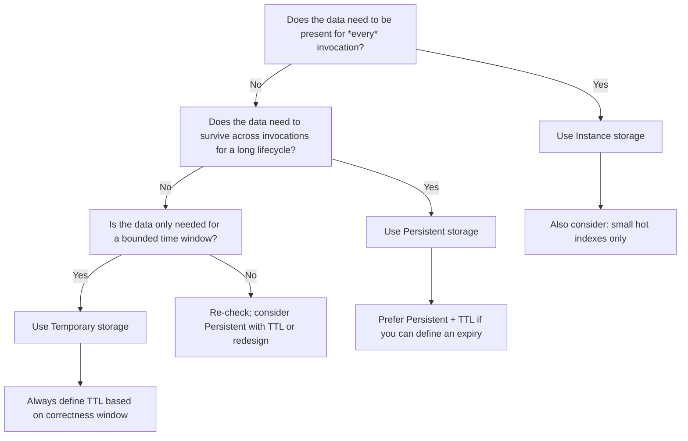

# VaultDAO Storage Architecture Deep-Dive (Instance vs Persistent vs Temporary) + Cost Model

> Audience: contributors extending VaultDAO contract features.

This document explains:

1. **When to use Soroban storage types** in VaultDAO (**Instance**, **Persistent**, **Temporary**) with concrete rules.
2. **How TTL works** (including what happens on expiry and how TTL extension affects rent).
3. A **cost model** for estimating ledger rent impact (with example calculations).
4. **Storage key design patterns** (namespacing, collision avoidance, key size considerations).
5. A **current VaultDAO storage inventory**: every storage key variant in `contracts/vault/src/storage.rs`.
6. **Migration considerations**: safely changing storage type for existing data.

## 0) Storage types in Soroban (VaultDAO usage model)

Soroban provides three storage classes:

- **Instance storage** (`env.storage().instance()`): data kept permanently by default and loaded into the contract’s state for every invocation.
- **Persistent storage** (`env.storage().persistent()`): long-lived data (survives across invocations) that can optionally have TTL to reclaim rent.
- **Temporary storage** (`env.storage().temporary()`): time-bounded data that is cheap and auto-evicts when TTL expires.

VaultDAO uses a **hybrid storage model** optimized for ledger rent:

- frequently accessed configuration and indexes → **Instance**
- canonical state that must outlive invocations → **Persistent** (often with TTL)
- short-lived counters / windows / snapshots → **Temporary**

The contract also uses **TTL extension** heavily via `extend_ttl` to reclaim rent while tolerating late readers and retry windows.

## 1) Storage type decision tree (Mermaid)

Use this decision tree when adding new state.

## 2) Concrete rules: when to use each storage type

### 2.1 Use **Instance** storage when…

- The value is a **configuration constant** or **hot index** that is required during normal execution paths.
- The value is small and frequently used (avoids repeated persistent reads).
- The value has a **nearly indefinite lifecycle** and TTL would be either unnecessary or counterproductive.

In `contracts/vault/src/storage.rs`, common Instance storage usage includes:

- Initialization flag: `DataKey::Initialized`
- Core config: `DataKey::Config`
- Indexes/counters used for enumeration and next-ID allocation (e.g., `NextProposalId`, `NextRecurringId`)
- Hot “current window” metrics stored as instance when it’s aggregated and used for derived views.

### 2.2 Use **Persistent** storage when…

- The value represents **canonical state**: proposals, escrow objects, retry state, subscriptions, etc.
- The data must outlive invocations.
- You can define a **TTL strategy** to avoid unbounded rent when data becomes irrelevant.

In `storage.rs`, many persistent keys are extended with TTL, for example:

- Proposals: `PROPOSAL_TTL` based extension
- Roles and whitelists: `INSTANCE_TTL_THRESHOLD` + `INSTANCE_TTL`
- Many “feature keys” (`FeatureKey::*`) use `extend_ttl` with `PERSISTENT_TTL` / `PROPOSAL_TTL`.

### 2.3 Use **Temporary** storage when…

- The value is a **counter or window** that is only required for a short time.
- The value can be evicted without breaking correctness (once TTL expires, the system must behave as if the data is reset/absent).

Examples from `storage.rs`:

- Daily spent counters: `DataKey::DailySpent(day)`
- Weekly spent counters: `DataKey::WeeklySpent(week)`
- Velocity histories: `temporary()` usage with TTL extension
- Execution snapshots: `ExecutionSnapshot` in temporary storage
- Streaming rate limiter window: `DataKey::StreamRateWindow(stream_id)`

## 3) TTL mechanics in VaultDAO

### 3.1 TTL constants used in the contract

From `contracts/vault/src/storage.rs`:

- `DAY_IN_LEDGERS = 17_280` (~24 hours at 5 s/ledger)
- `PROPOSAL_TTL = DAY_IN_LEDGERS * 7` (7 days)
- `INSTANCE_TTL = DAY_IN_LEDGERS * 30` (30 days)
- `PERSISTENT_TTL = DAY_IN_LEDGERS * 30` (30 days)
- `INSTANCE_TTL_THRESHOLD = DAY_IN_LEDGERS * 7`
- `PERSISTENT_TTL_THRESHOLD = DAY_IN_LEDGERS * 7`

These are used with:

- `extend_ttl(&key, threshold, ttl)`

### 3.2 What TTL extension means

`extend_ttl(key, threshold, ttl)` effectively says:

- if remaining TTL is below `threshold`, extend to `ttl`.
- this avoids paying rent for already-fresh entries repeatedly.

VaultDAO uses the pattern to keep recently accessed data alive but allow stale data to expire.

### 3.3 What happens on expiry

When TTL expires:

- data is evicted (no longer retrievable via `.get(&key)`)
- contract logic must handle missing data as “default state”

VaultDAO relies on this by using `.unwrap_or(0)` / `.unwrap_or_else(Vec::new(env))` defaults in getters.

### 3.4 How TTL affects correctness

You must set TTL based on **your correctness window**:

- For daily counters, TTL covers at least “the time until that day is no longer needed” plus safe margin.
- For proposal-related entries, TTL should cover typical cancel/execute delays.

Example in code:

- DailySpent TTL is extended for `DAY_IN_LEDGERS * 2` (covers ~48 hours).
- WeeklySpent TTL is extended for `DAY_IN_LEDGERS * 14`.
- Execution snapshots are stored for `DAY_IN_LEDGERS`.

### 3.5 TTL extension under adversarial timing

Important: because TTL eviction is time-based, you must ensure:

- If a function expects the data to exist (e.g. replay prevention or rate windows), TTL must cover the worst-case time between setting and reading.
- If retries or delayed execution exist, the TTL must cover those spans.

## 4) Cost model: estimating storage rent impact

### 4.1 Required constraint: use current Stellar fee parameters

This repository snapshot does not include the current network fee parameters required to compute exact rent costs.

However, VaultDAO can still be modeled with a **parametric cost function**:

- Rent is proportional to:
  - number of stored entries
  - size of entries (key + value)
  - storage type
  - time stored (TTL coverage)

Because TTL values in ledgers are explicit constants, you can compute a **rent multiplier** even without the fee base:

- `rent_multiplier = entries * (ttl_ledgers / ledgers_per_month)`

Then multiply by a fee-per-ledger-storage unit from Stellar (cite version in your deployment notes).

> Cost numeric examples in this doc are intentionally parametric because the repo snapshot does not include the **current** Stellar rent/fee parameters.
>
> When publishing, replace the coefficients in the cost model with current network values and include a citation such as:
>
> - Stellar network fee parameter version (cite)
> - Soroban storage rent formula / TTL semantics source (cite)

### 4.2 Parametric storage cost formula

Define:

- `N` = number of entries
- `S` = average entry size in bytes (roughly)
- `T` = average TTL coverage in ledgers
- `c_instance`, `c_persistent`, `c_temporary` = rent coefficient per byte per ledger for each storage type

Then:

- `Cost ≈ N * S * T * c_storage`

### 4.3 Example calculation: 100 proposals vs 100 spending-limit counters

#### Assumptions (explicit)

- 100 proposals stored in Persistent storage.
- Each proposal entry has “some size”; we approximate relative cost only.
- Daily spending counters stored in Temporary storage.
- Each counter is one ledger-window bucket.

#### Proposal TTL

From `storage.rs`:

- proposal TTL used for `.extend_ttl(&key, PROPOSAL_TTL / 2, PROPOSAL_TTL)`
- `PROPOSAL_TTL = 7 days`.

So for “time stored” model, `T_proposal ≈ 7 days`.

#### Daily spending TTL

From `storage.rs`:

- daily counters TTL extended to `DAY_IN_LEDGERS * 2` (2 days).
- `T_daily_spent ≈ 2 days`.

#### Relative cost ratio (storage-type aware)

Let the per-byte rent coefficient be:

- `c_P` for persistent
- `c_T` for temporary

Then:

- Proposal cost: `100 * S_prop * (7d) * c_P`
- Counter cost: `100 * S_ctr * (2d) * c_T`

So ratio:

- `ratio = (100 * S_prop * 7 * c_P) / (100 * S_ctr * 2 * c_T)`
- `ratio = (S_prop / S_ctr) * (7/2) * (c_P / c_T)`

**Interpretation:** Even with lower TTL, proposals can still dominate due to larger value sizes, while counters are smaller and temporary.

### 4.4 Cost analysis table (parametric)

| Scenario            | N entries | Storage type | TTL model | Relative cost            |
| ------------------- | --------: | ------------ | --------: | ------------------------ |
| 100 proposals       |       100 | Persistent   |        7d | `100 * S_prop * 7 * c_P` |
| 100 daily counters  |       100 | Temporary    |        2d | `100 * S_ctr * 2 * c_T`  |
| 100 weekly counters |       100 | Temporary    |       14d | `100 * S_ctr * 14 * c_T` |

> Replace coefficients using current Stellar rent parameters for exact numeric results.

## 5) Storage key design patterns

VaultDAO’s storage keys are intentionally split into:

- **Small, typed discriminants** (`DataKey`, `CounterKey`, `VestingKey`, `CalendarKey`)
- **Feature-scoped keys** (`FeatureKey`) to avoid enum size limits

### 5.1 Namespacing

Rules:

- Use separate enums for different key families (`DataKey` vs `FeatureKey`).
- For dynamic keys (addresses, ids), use typed key constructors that encode the entity.

### 5.2 Collision avoidance

Soroban storage keys must uniquely map to a value. In VaultDAO:

- `DataKey::Proposal(u64)` and `FeatureKey::Proposal(...)` are distinct enums, so even if numeric values overlap, they don’t collide.
- For Symbol-based indexing (e.g., tags), VaultDAO converts symbols to deterministic u64 via SHA-256 and uses that as a discriminant (see `symbol_to_u64_key`).

### 5.3 Key size and rent

General guidance:

- Prefer compact discriminants (u32/u64) over long strings for key components.
- Avoid embedding large vectors directly into keys—store them as values.

VaultDAO follows this by using:

- `BytesN<32>` for hashes
- `Symbol` where needed but mapping Symbols to u64 discriminants for key space efficiency.

## 6) VaultDAO storage inventory (all keys in `storage.rs`)

This inventory lists every variant in `DataKey` and every variant in `FeatureKey` as defined in `contracts/vault/src/storage.rs`.

### 6.1 `DataKey` variants

From `#[contracttype] pub enum DataKey { ... }`:

- `Initialized`
- `Config`
- `Role(Address)`
- `RoleIndex`
- `Proposal(u64)`
- `NextProposalId`
- `PriorityQueue(u32)`
- `DailySpent(u64)`
- `WeeklySpent(u64)`
- `Recurring(u64)`
- `NextRecurringId`
- `VelocityHistory(Address)`
- `ListMode`
- `Whitelist(Address)`
- `Blacklist(Address)`
- `Comment(u64)`
- `ProposalComments(u64)`
- `NextCommentId`
- `AuditEntry(u64)`
- `NextAuditId`
- `LastAuditHash`
- `Attachments(u64)`
- `Reputation(Address)`
- `VotingStrategy`
- `ApprovalLedger(u64, Address)`
- `Stream(u64)`
- `NextStreamId`
- `CancellationRecord(u64)`
- `CancellationHistory`
- `AmendmentHistory(u64)`
- `ExecutionSnapshot(u64)`
- `ExecutionFeeEstimate(u64)`
- `StreamRateWindow(u64)`
- `InsuranceClaim(u64)`
- `NextInsuranceClaimId`
- `InsuranceClaimVote(u64, Address)`
- `TokenDailySpent(Address, u64)`
- `TokenWeeklySpent(Address, u64)`
- `TokenSpendingConfig(Address)`
- `Delegation(Address)`
- `DelegationHistory(Address)`
- `NextDelegationId`
- `DelegatorsFor(Address)`
- `VelocityHistoryByToken(Address, Address)`
- `StatusIndex(u32)`
- `WhitelistIndex`
- `BlacklistIndex`
- `NotificationPrefsIndex`
- `HTag(u64)`
- `HTagChildren(u64)`
- `HTagProposals(u64)`
- `ProposalHTagIds(u64)`
- `NextHTagId`
- `HTagCount`
- `HTagNameScope(u64)`
- `ColdSig(u64, BytesN<32>)`
- `ColdSigIndex(u64)`
- `ColdSigUsed(BytesN<32>)`
- `VarTemplate(u64)`
- `NextVarTemplateId`
- `VarTemplateCount`
- `VarTemplateName(Symbol)`
- `ProposalVarRef(u64)`
- `VarTemplateProposals(u64)`

### 6.2 `CounterKey` variants

- `Template = 1`
- `Escrow = 2`
- `Dispute = 3`
- `Subscription = 4`
- `Recovery = 5`
- `FundingRound = 6`
- `Batch = 7`
- `ScopedDelegation = 8`

### 6.3 `VestingKey` variants

- `Schedule(u64)`
- `NextId`
- `ActiveCount`
- `Reserved(Address)`

### 6.4 `CalendarKey` variants

- `Holidays`

### 6.5 `FeatureKey` variants

From `pub enum FeatureKey { ... }`:

- `Counter(CounterKey)`
- `InsuranceConfig`
- `NotificationPrefs(Address)`
- `DexConfig`
- `SwapProposal(u64)`
- `SwapResult(u64)`
- `GasConfig`
- `ExecutionFeeEstimate(u64)`
- `Metrics`
- `Template(u64)`
- `TemplateName(Symbol)`
- `RetryState(u64)`
- `Escrow(u64)`
- `FunderEscrows(Address)`
- `RecipientEscrows(Address)`
- `InsurancePool(Address)`
- `TokenLock(Address)`
- `TimeWeightedConfig`
- `TotalLocked(Address)`
- `FeeStructure`
- `FeesCollected(Address)`
- `UserVolume(Address, Address)`
- `StakingConfig`
- `StakePool(Address)`
- `StakeRecord(u64)`
- `CrossVaultProposal(u64)`
- `CrossVaultConfig`
- `BridgeRecord(BytesN<32>)`
- `Dispute(u64)`
- `ProposalDisputes(u64)`
- `Batch(u64)`
- `BatchResult(u64)`
- `BatchRollback(u64)`
- `ThresholdReduced(u64)`
- `RecoveryProposal(u64)`
- `FundingRound(u64)`
- `ProposalFundingRounds(u64)`
- `FundingRoundConfig`
- `VaultOracleConfig`
- `VotingStrategy`
- `ApprovalLedger(u64, Address)`
- `Permissions(Address)`
- `DelegatedPermission(Address, Address, u32)`
- `Subscription(u64)`
- `SubscriberIndex(Address)`
- `ReputationConfig`
- `BridgeConfig`
- `CrossChainProposal(u64)`
- `BridgeLock(u64)`
- `MetricsBucket(u64)`
- `MetricsBucketIndex`
- `PendingConfig`
- `WhitelistEntry(Address)`
- `MultiPhaseProposal(u64)`
- `CapabilityToken(BytesN<32>)`
- `Moderator(Address)`
- `CommentRateCount(u64, Address, u64)`
- `CostModel`
- `ColdSignerConfig`
- `DeadLetter(u64)`
- `DeadLetterCount`

## 7) Migration considerations (changing storage type)

If you decide that an existing key should move from Persistent ↔ Instance ↔ Temporary:

### 7.1 Never lose invariants

- If a value is required to enforce security checks (replay prevention, permission expiry), TTL must cover the time-to-use.
- When migrating, ensure the old storage location and new storage location are consistent for at least one full correctness window.

### 7.2 Safe migration pattern

1. **Dual-write** during a transition period:
   - write both old and new storage types
2. **Prefer new reads** after the first migration block
3. **Garbage collect old data** once:
   - you are sure no invocations depend on the old storage
   - TTL on old data has elapsed

### 7.3 TTL changes and backward compatibility

If you reduce TTL:

- ensure that any delayed execution, replay protection, or UI/indexer lag still functions when data is evicted.

If you increase TTL:

- expect higher rent until TTL expires.

## 8) Suggested workflow for contributors

When implementing a feature:

1. Identify the data’s **correctness window** (how long it must exist).
2. Choose storage type using the decision tree.
3. If Persistent/Temporary, define TTL values using the same ledger constants or add new constants.
4. Add getters that default safely when TTL eviction occurs.
5. Update `docs/reference/STORAGE.md` if new key types are introduced.

## Appendix A: Soroban documentation citations

This repo should cite external Soroban docs for exact rent mechanics and TTL semantics.

In this document, rent is modeled parametrically because current Stellar fee coefficients are not included in the repository snapshot.

When you publish this doc, include:

- Stellar network fee parameter version (cite)
- Soroban storage rent formula source (cite)

---

End of document.
